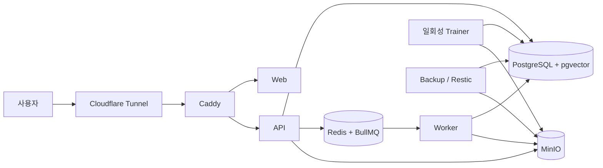
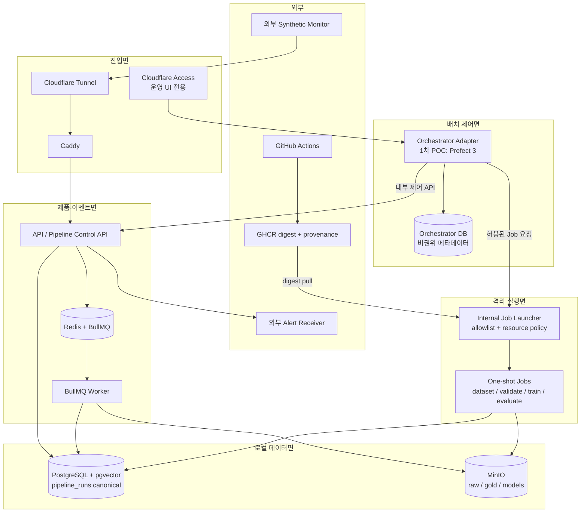

# AI 학습 데이터 파이프라인 인프라 v2 PRD

> 상태: 초안(Draft) — 사용자 승인 전
> 작성일: 2026-07-19
> 대상 환경: MacBook Pro M3 Pro(11 CPU, 18GB RAM) 단일 Docker 운영 서버
> 목표: 특정 오케스트레이터에 종속되지 않는 전체 인프라를 먼저 확정한 뒤 단계적으로 구축한다.

## 1. 프로젝트 개요

### 1.1 배경

현재 시스템은 PostgreSQL/pgvector, Redis/BullMQ, MinIO, NestJS API/Worker, Next.js Web,
Cloudflare Tunnel을 단일 Mac의 Docker Compose로 운영한다. AI 학습 데이터 파이프라인에는 이미
`pipeline_runs`, 단계 실행, 데이터 계보, 데이터셋, 평가, 모델 레지스트리, shadow/canary, alias 기반
승격·롤백이 구현되어 있다.

현재 가장 큰 문제는 학습 알고리즘 자체가 아니다.

1. 운영 Mac에서 애플리케이션 이미지를 직접 빌드해 Docker 디스크가 고갈된 이력이 있다.
2. 개발 서버가 없어 변경 검증과 운영 배포의 경계가 약하다.
3. 실시간 이벤트 처리와 데이터셋 생성·학습·평가 같은 유한한 배치 작업의 제어 책임이 섞일 수 있다.
4. 오프사이트 백업과 외부 경보 수신처가 아직 운영 입력으로 연결되지 않았다.
5. 배치 오케스트레이터 도입 시 제품 계보와 실행 상태를 중복 소유할 위험이 있다.
6. 실제 운영 학습은 사람 확정 라벨 100개, 3개 클래스, 클래스별 10개 조건을 아직 충족하지 못한다.

따라서 Airflow를 포함한 특정 제품을 먼저 설치하지 않는다. 먼저 데이터면, 제어면, 실행면, 배포면,
관측면, 복구면의 경계를 고정하고 오케스트레이터는 교체 가능한 어댑터로 도입한다.

### 1.2 사용자

- 주 사용자: 단일 Mac 운영자 1명
- 간접 사용자: 서비스 이용자와 데이터 주체
- 향후 사용자: 파이프라인 개발자·검토자, 모델 승인 담당자

### 1.3 성공의 정의

- 운영 Mac은 소스 빌드를 수행하지 않고 검증·증명된 이미지 digest만 배포한다.
- 실시간 이벤트 처리는 BullMQ가 계속 담당하고, 배치 오케스트레이션 장애가 수집 경로를 멈추지 않는다.
- 모든 배치 실행은 기존 `pipeline_runs`를 기준 기록으로 사용하고 외부 실행 ID만 상호 연결한다.
- 한 번에 학습 Job 하나만 실행해 운영 API/Worker의 자원을 보호한다.
- 재부팅, 단계 실패, 중복 트리거, 취소, 재시도, 백필 후에도 실행 상태와 artifact 계보가 일치한다.
- Mac 전체 손실을 가정한 오프사이트 복구 리허설이 성공한다.
- 오케스트레이터를 제거해도 기존 수동 실행과 BullMQ 경로로 안전하게 롤백할 수 있다.

## 2. 목표와 비목표

### 2.1 목표

- G-001: 단일 Mac에 맞는 전체 AI 파이프라인 인프라 목표 구조를 확정한다.
- G-002: CI 검증, 이미지 게시, digest 고정, 배포, 검증, 롤백을 하나의 공급망으로 만든다.
- G-003: 이벤트 처리와 배치 워크플로우의 책임을 분리한다.
- G-004: 오케스트레이터에 업무 로직과 제품 계보가 종속되지 않게 한다.
- G-005: 개인정보를 로컬 데이터면에 유지하고 외부 시스템에는 민감한 payload를 전송하지 않는다.
- G-006: 단일 호스트 장애를 감지하고 다른 장애 도메인의 백업에서 복구할 수 있게 한다.
- G-007: 측정 가능한 POC를 거쳐 오케스트레이터 도입 여부와 제품을 결정한다.

### 2.2 비목표

- NG-001: 현재 단계에서 Kubernetes, Kafka, Spark, lakehouse를 구축하지 않는다.
- NG-002: 기존 BullMQ 이벤트 파이프라인을 배치 오케스트레이터로 교체하지 않는다.
- NG-003: 기존 모델 레지스트리·계보를 MLflow 또는 오케스트레이터 메타데이터로 교체하지 않는다.
- NG-004: 라벨 진입 게이트를 낮추거나 AI 예측을 사람 확정 라벨로 재사용하지 않는다.
- NG-005: 운영 데이터를 GitHub Actions, 외부 오케스트레이터 Cloud 또는 외부 로그 서비스에 올리지 않는다.
- NG-006: 단일 Mac에서 무중단 고가용성이나 다중 노드 합의를 제공한다고 주장하지 않는다.

## 3. 운영 제약과 설계 원칙

### 3.1 제약

| 항목 | 제약 |
|---|---|
| 호스트 | MacBook Pro M3 Pro, 11 CPU, RAM 18GB |
| 운영 형태 | Docker Desktop + Compose 단일 운영 서버 |
| 외부 연결 | Cloudflare Tunnel 아웃바운드 연결 |
| 개발 환경 | 별도 장기 실행 개발 서버 없음 |
| 데이터 | 가족·금융 문맥 등 개인정보 포함 가능 |
| 학습 자원 | 현재 CPU 학습, trainer 1 CPU/1GiB |
| 학습 준비도 | 사람 확정 라벨 진입 게이트 미충족 |
| 복구 | 로컬 백업 구현 완료, 오프사이트 저장소 연결 필요 |

### 3.2 설계 원칙

1. PostgreSQL은 상태·메타데이터·계보의 기준 저장소다.
2. MinIO는 immutable 원본·데이터셋·모델 artifact의 기준 저장소다.
3. Redis/BullMQ는 짧고 반복적인 이벤트형 증분 처리와 재시도를 담당한다.
4. 배치 오케스트레이터는 순서·스케줄·재시도·백필·승인 대기만 담당한다.
5. 업무 로직은 버전 고정 API, CLI 또는 일회성 컨테이너 Job에 둔다.
6. `pipeline_runs`가 제품 실행의 canonical record이고 외부 오케스트레이터 DB는 재생성 가능한 운영 메타데이터다.
7. 운영 Mac은 build host가 아니라 pull-and-run host다.
8. 모든 이미지는 tag가 아니라 digest로 배포한다.
9. Docker Engine 권한은 root 권한과 동등하게 취급하며 UI·오케스트레이터 서버에 직접 부여하지 않는다.
10. PII와 secret은 외부 CI, 이미지, 실행 이름, 태그, 상태 메시지, 로그에 넣지 않는다.
11. 장애 시 고급 제어면보다 기존 수집·서빙 경로를 우선 복구한다.
12. 용량과 운영 복잡도는 관측된 임계치를 넘을 때만 확장한다.

## 4. 현행 구조

현행 구조는 소규모 이벤트 수집과 로컬 학습에 적합하다. 보완 대상은 데이터 기술의 전면 교체가 아니라
검증된 이미지 공급, 안전한 Job 실행 경계, 배치 제어, 외부 장애 감지, 오프사이트 복구다.

## 5. 목표 아키텍처

### 5.1 논리 평면

| 평면 | 책임 | 구성 |
|---|---|---|
| 진입면 | 공개 요청과 운영 UI 접근 통제 | Cloudflare Tunnel, Access, Caddy |
| 제품면 | API·Web·실시간 이벤트 처리 | API, Web, Worker, Redis/BullMQ |
| 데이터면 | 기준 데이터·원본·artifact | PostgreSQL/pgvector, MinIO |
| 제어면 | 배치 일정·순서·재시도·백필 | 교체 가능한 Orchestrator, Control Adapter |
| 실행면 | 허용된 일회성 Job 격리 실행 | Internal Job Launcher, digest 고정 Job image |
| 배포면 | 검증·빌드·증명·배포·롤백 | GitHub Actions, GHCR, release manifest, deploy script |
| 관측면 | 상태·로그·SLO·외부 장애 감지 | 기존 dashboard/alert outbox, 구조화 로그, 외부 synthetic monitor |
| 복구면 | 백업·오프사이트 복제·복구 리허설 | local snapshot, restic repository, restore verifier |

### 5.2 목표 데이터 흐름

### 5.3 핵심 경계

- Orchestrator Adapter는 `createRun`, `startStep`, `completeStep`, `failStep`, `cancelRun`, `reconcileRun`
  계약만 사용한다.
- Job Launcher는 미리 등록된 `jobType`, image digest, command, CPU, memory, timeout, network, 읽을 secret
  목록만 허용한다. 임의 이미지·명령·bind mount·privileged 실행을 거부한다.
- Docker socket은 Job Launcher만 가진다. Prefect server, UI, flow worker, API, Web은 갖지 않는다.
- Job은 `pipelineRunId`, `stepRunId`, `idempotencyKey`만 입력받고 원문 payload는 PostgreSQL/MinIO에서
  최소 권한 credential로 읽는다.
- Job 결과는 DB 상태와 MinIO artifact checksum으로 기록한다. 오케스트레이터 로그는 식별 불가능한 수치와
  오류 코드만 보존한다.

## 6. 오케스트레이터 후보 평가

### 6.1 평가 방식

점수는 1(부적합)~5(매우 적합)이며 가중 합계는 500점 만점이다.

| 기준 | 가중치 | 현행 자체 제어면 | Prefect 3 | Dagster | Airflow | Temporal |
|---|---:|---:|---:|---:|---:|---:|
| 단일 호스트 운영 부담 | 25 | 5 | 4 | 3 | 2 | 1 |
| 격리 Job·자원 제어 연계 | 20 | 2 | 4 | 5 | 4 | 5 |
| 스케줄·재시도·백필 | 15 | 2 | 4 | 5 | 5 | 3 |
| 기존 계보와 공존 | 15 | 5 | 4 | 3 | 4 | 4 |
| self-host·보안 경계 | 10 | 5 | 3 | 3 | 3 | 3 |
| 실행 환경 이식성 | 10 | 2 | 5 | 4 | 4 | 5 |
| 생태계·운영 인력 수급 | 5 | 1 | 4 | 4 | 5 | 4 |
| 가중 합계 | 100 | 345 | **400** | 385 | 360 | 330 |
| 환산 점수 | 100 | 69 | **80** | 77 | 72 | 66 |

### 6.2 평가 해석

- Prefect 3: self-hosted server와 worker/work pool 구조가 작고 Docker 실행 환경으로 이동하기 쉽다.
  기존 계보를 유지하면서 얇은 Python flow를 제어 어댑터로 쓰기 적합하다.
- Dagster: asset, partition, backfill, run별 컨테이너가 강점이다. 그러나 현재 제품이 데이터셋·계보를 이미
  소유하므로 asset catalog를 병행하면 중복 모델이 늘어난다.
- Airflow: 배치 스케줄·백필 생태계와 인력 수급이 강점이다. 단일 Mac에서는 API server, scheduler,
  DAG processor, metadata DB 등 상시 구성과 자원 경합이 상대적으로 크다.
- Temporal: 장기 실행과 내구성 있는 workflow에 강하지만 현재의 데이터 배치 UI·운영 문제에 비해
  self-hosted service 복잡도가 크다.
- 현행 자체 제어면: 가장 단순하지만 스케줄·백필·시각화·재시도 정책을 계속 자체 개발해야 한다.

### 6.3 1차 결정

DEC-001: **self-hosted Prefect 3를 1차 POC 대상으로 선정한다.** 이는 영구 채택 결정이 아니다.

DEC-002: Prefect에는 flow 정의와 실행 메타데이터만 둔다. 데이터 asset, 모델, lineage의 기준은 기존
PostgreSQL/MinIO에 유지한다.

DEC-003: self-hosted Prefect OSS에 조직용 RBAC, audit log, SSO가 없다는 제약을 전제로 UI/API는 Docker
내부망에만 두고, 원격 UI가 필요할 때만 별도 hostname과 Cloudflare Access allow 정책으로 보호한다.

DEC-004: Prefect POC가 합격하지 못하면 현재 제어면을 유지하고 Dagster를 2차 후보로 평가한다. Airflow는
다수 DAG 운영자, 표준 provider 요구, 복잡한 기간 백필이 실제 핵심 문제가 될 때 재평가한다.

### 6.4 POC 합격 기준

- POC-001: 비식별 synthetic 데이터로 snapshot→validate→train-dry-run→evaluate→approval-wait 흐름이 성공한다.
- POC-002: 동일 idempotency key의 중복 트리거가 Job을 두 번 만들지 않는다.
- POC-003: 단계 재시도, timeout, 수동 취소, 특정 기간 백필을 UI/API에서 수행한다.
- POC-004: Prefect 재시작과 Mac/Docker 재부팅 후 20분 안에 미완료 run을 조정한다.
- POC-005: Prefect server+worker의 정상 idle 메모리 합계가 1.25GiB 이하이다.
- POC-006: 동시 flow run과 heavy Job은 각각 1개로 제한된다.
- POC-007: Prefect와 공개 ingress 컨테이너에는 Docker socket이 없다.
- POC-008: Prefect DB를 제거해도 `pipeline_runs`를 기준으로 미완료 실행을 식별할 수 있다.
- POC-009: Prefect를 중단한 뒤 기존 수동 trainer 실행으로 15분 안에 롤백한다.
- POC-010: Prefect 상태·태그·로그·오류에 PII, 원문, secret, MinIO object key가 없다.

### 6.5 POC 탈락 기준

- 상시 메모리 예산을 두 번 이상 초과한다.
- Docker socket을 UI/서버 또는 외부 도달 가능 컨테이너에 부여해야만 요구사항을 충족한다.
- canonical 상태와 Prefect 상태의 불일치를 자동 조정할 수 없다.
- 배치 제어면 장애가 API, 수집, BullMQ 처리 또는 모델 서빙을 중단시킨다.
- 운영자가 기존 수동 경로보다 실패 원인을 파악하거나 복구하기 어려워진다.

## 7. 기능 요구사항

### 7.1 배포 공급망

- FR-001: PR마다 GitHub-hosted runner에서 lint, typecheck, unit/integration test를 실행해야 한다.
- FR-002: 통합 테스트는 임시 PostgreSQL, Redis, MinIO를 사용하고 운영 endpoint·credential을 참조하지 않아야 한다.
- FR-003: main 승인 후 linux/arm64 또는 multi-platform 운영 이미지를 GitHub Actions에서 빌드해야 한다.
- FR-004: 앱, backup, pipeline Job, Job Launcher 이미지를 GHCR에 게시하고 commit SHA와 OCI metadata를 기록해야 한다.
- FR-005: 각 운영 이미지에 SBOM과 build provenance attestation을 생성해야 한다.
- FR-006: 운영 Compose는 `${IMAGE}@sha256:...` 형식의 release manifest만 사용해야 한다.
- FR-007: 운영 Mac의 배포 전 단계는 디스크 여유, 백업 최신성, registry 접근, image attestation을 검사해야 한다.
- FR-008: 배포는 pull→migration→service recreate→internal health→public smoke 순서로 진행해야 한다.
- FR-009: 이전 release manifest를 보존하고 migration 호환 범위 안에서 한 명령으로 롤백할 수 있어야 한다.
- FR-033: main image 게시만으로 운영 배포가 자동 시작되어서는 안 되며, 운영자가 검증된 release manifest를
  명시적으로 승인해야 배포할 수 있어야 한다.

### 7.2 파이프라인 제어

- FR-010: 수동, schedule, dataset-ready, backfill 트리거를 공통 run 생성 계약으로 변환해야 한다.
- FR-011: run 생성 시 `pipeline_runs`를 먼저 기록한 뒤 외부 orchestrator run ID를 연결해야 한다.
- FR-012: 각 단계는 명시적 입력 버전, 코드 SHA, 설정 hash, image digest, idempotency key를 기록해야 한다.
- FR-013: retryable과 terminal 오류를 구분하고 terminal 오류만 기존 alert outbox로 전달해야 한다.
- FR-014: 승인 단계는 자동 모델 승격을 금지하고 기존 모델 승인·alias 정책을 호출해야 한다.
- FR-015: 취소된 run은 새 단계를 시작하지 않고 실행 중 Job에 종료 요청을 전달해야 한다.
- FR-016: 오케스트레이터 상태와 canonical 상태를 주기적으로 대조하는 reconciler가 있어야 한다.
- FR-017: 오케스트레이터가 비활성일 때 운영자는 기존 API와 Compose profile로 Job을 수동 실행할 수 있어야 한다.

### 7.3 격리 실행

- FR-018: Job Launcher는 서버에서 정의한 job allowlist 외 요청을 거부해야 한다.
- FR-019: 각 Job은 digest 고정 이미지, read-only root filesystem, non-root user, PID/CPU/memory/timeout 상한을 가져야 한다.
- FR-020: Job은 필요한 내부 데이터 network만 사용하고 공개 ingress network에 연결하지 않아야 한다.
- FR-021: 학습·대규모 추출 Job의 전체 동시성은 기본 1이어야 한다.
- FR-022: Job 종료 시 exit code, 제한된 stdout/stderr, 시작·종료 시각, artifact checksum을 단계 실행에 연결해야 한다.
- FR-023: 동일 idempotency key로 active/succeeded Job이 있으면 재사용하고 새 컨테이너를 만들지 않아야 한다.
- FR-024: 실행 전 admission check가 메모리 headroom, Docker 디스크, 백업 상태를 확인해야 한다.
- FR-034: read-only root filesystem을 사용하는 Job은 등록된 크기 제한 tmpfs 작업 경로만 쓸 수 있어야 하며,
  종료 시 임시 파일을 보존하지 않아야 한다.

### 7.4 관측·복구

- FR-025: 서비스 health, queue depth/age, run 상태, Job 자원, disk, backup freshness를 한 운영 화면에서 확인해야 한다.
- FR-026: Docker 로그에는 회전 정책을 적용하고 PII/secret redaction 테스트를 수행해야 한다.
- FR-027: 동일 Mac 외부의 synthetic monitor가 공개 health 실패 또는 Cloudflare 5xx를 5분 이내 감지해야 한다.
- FR-028: pipeline terminal failure, quarantine, canary breach, backup stale, disk low 알림을 외부 receiver로 보내야 한다.
- FR-029: PostgreSQL과 MinIO의 로컬 스냅샷을 6시간마다 만들고 checksum/manifest를 생성해야 한다.
- FR-030: 최신 로컬 스냅샷을 다른 장애 도메인의 암호화 restic repository에 24시간 이내 복제해야 한다.
- FR-031: 월 1회 격리 복원과 DB↔MinIO 참조 무결성 검사를 자동 또는 runbook으로 수행해야 한다.
- FR-032: 복구 결과와 실제 RPO/RTO를 운영 기록에 남겨야 한다.

### 7.5 운영 감사와 보존

- FR-035: 배포, run 수동 시작·취소·재시도, backfill, 모델 승인·승격·롤백에는 actor, action, 대상 ID,
  사유, 결과, 시각을 PII 없이 감사기록으로 남겨야 한다.
- FR-036: 비권위 orchestration 실행 로그·상세 메타데이터는 30일, 운영 감사기록은 1년을 기본 보존하고
  만료 정리를 자동화해야 한다. canonical pipeline lineage의 보존은 기존 제품 정책을 따른다.

### 7.6 요구사항 우선순위

| 우선순위 | 범위 | 구현 게이트 |
|---|---|---|
| P0 — 운영 안전 기반 | FR-001~009, FR-025~033, FR-035~036 | 오케스트레이터 구현 전 완료 |
| P1 — 중립 실행 기반 | FR-010~024, FR-034 | Prefect POC 전 완료 |
| P2 — 오케스트레이터 POC | POC-001~010 | production dependency 승격 전 완료 |
| P3 — 운영 워크플로우 전환 | M5·M6 및 AC 전체 | 실제 schedule 활성화 전 완료 |

## 8. 비기능 요구사항

- NFR-001: Docker Desktop 메모리 상한은 12GiB 이하로 두고 macOS에 최소 6GiB를 남겨야 한다.
- NFR-002: 상시 서비스 제한 합계는 10GiB 이하, 실제 정상 사용 목표는 8GiB 이하이어야 한다.
- NFR-003: heavy Job 시작 전 사용 가능 headroom은 3GiB 이상이어야 한다.
- NFR-004: 배치 제어면 중단이 공개 API·Web·BullMQ Worker·현재 production model 서빙에 영향을 주지 않아야 한다.
- NFR-005: 정상 이벤트의 queue 대기 시간 p95는 5분 이하여야 한다.
- NFR-006: schedule run의 시작 지연은 정상 상태에서 5분 이하여야 한다.
- NFR-007: terminal pipeline 경보는 상태 확정 후 5분 안에 외부 receiver에 도착해야 한다.
- NFR-008: 모델 alias 롤백은 15분 안에 완료되어야 한다.
- NFR-009: Mac/Docker 재부팅 후 공개 서비스는 15분, run 조정은 20분 안에 완료되어야 한다.
- NFR-010: 다른 장애 도메인 기준 RPO는 24시간, RTO는 4시간이어야 한다.
- NFR-011: local backup 기준 RPO는 6시간이어야 한다.
- NFR-012: 운영 image, flow, Job contract는 버전을 명시하고 하위 호환 기간을 최소 1개 release 유지해야 한다.
- NFR-013: secret과 PII가 CI artifact, image layer, orchestration metadata, 구조화 로그에 포함되지 않아야 한다.
- NFR-014: 외부 오케스트레이터 Cloud 사용 없이 핵심 파이프라인을 운영할 수 있어야 한다.
- NFR-015: 새 외부 라이브러리는 lockfile 고정, license 확인, 취약점 검사를 통과해야 한다.
- NFR-016: 공개 서비스 월간 가용성 목표는 계획된 유지보수를 제외하고 99.5% 이상이어야 한다.

## 9. 자원 예산

다음 값은 POC 시작 상한이며 실제 측정 후 낮추거나 조정한다.

| 서비스 그룹 | CPU 상한 | 메모리 상한 | 비고 |
|---|---:|---:|---|
| PostgreSQL | 2.0 | 2GiB | app DB와 별도 Prefect DB/user |
| Redis | 0.5 | 512MiB | maxmemory/보존 정책 별도 검증 |
| MinIO | 1.0 | 1GiB | console 외부 미노출 |
| API | 1.0 | 1GiB | 공개 요청 |
| Worker | 1.5 | 1.5GiB | 이벤트 큐 우선 |
| Web | 0.5 | 768MiB | Next.js runtime |
| Caddy + cloudflared | 0.5 | 384MiB | 진입면 |
| Backup daemon | 0.5 | 512MiB | backup 시간대 heavy Job 금지 |
| Prefect server | 0.5 | 768MiB | POC idle 측정 필수 |
| Prefect process worker | 0.5 | 512MiB | flow 제어만 수행 |
| Job Launcher | 0.25 | 256MiB | 내부 전용 |
| Trainer/Heavy Job | 1.0 | 1GiB | 동시성 1, 일회성 |
| 관측 보조 서비스 | 0.5 | 512MiB | 초기에는 기존 dashboard 우선 |

CPU 상한 합은 모든 서비스가 동시에 최대치를 쓰는 예약값이 아니다. admission controller는 backup,
training, 대규모 backfill을 서로 겹치지 않게 해야 한다.

## 10. 보안과 개인정보

### 10.1 네트워크

- PostgreSQL, Redis, MinIO, Prefect API/UI, Job Launcher는 host port를 공개하지 않는다.
- 공개 앱과 운영 UI는 hostname과 Caddy route를 분리한다.
- 운영 UI를 원격 공개할 때 Cloudflare Access에서 사용자 allowlist, MFA, 짧은 session을 적용한다.
- 공개 앱은 Prefect API나 Job Launcher로 라우팅할 수 없다.
- 가능하면 Cloudflare 계정의 내부 hostname에 deny-by-default Access 보호를 적용한다.

### 10.2 Docker 권한

- Docker socket을 가진 주체는 host root 수준 권한으로 간주한다.
- Job Launcher 외 컨테이너에는 socket을 mount하지 않는다.
- Launcher endpoint는 internal network와 service credential로만 접근한다.
- Launcher는 image registry/namespace/digest, command, network, mount, env key, resource profile을 검증한다.
- 임의 host bind, privileged, host network, device mount, Docker API proxy 기능을 금지한다.

### 10.3 데이터

- 원본, label, prompt 원문, dataset row, model artifact는 로컬 PostgreSQL/MinIO에 남긴다.
- GitHub/GHCR에는 코드, image, SBOM, provenance, 비민감 release metadata만 올린다.
- orchestration run name과 tag는 UUID와 비식별 pipeline 이름만 사용한다.
- 삭제·동의 철회는 기존 dataset→training run→model→alias→artifact 전파 정책을 그대로 사용한다.

### 10.4 Secret

- 운영 secret은 GitHub Actions에 넣지 않는다.
- Mac의 제한된 환경 파일 또는 macOS Keychain 기반 배포 입력을 사용하고 파일 권한을 검증한다.
- Job에는 job type별 최소 secret만 주입하고 환경 전체를 전달하지 않는다.
- secret rotation 후 이전 Job image를 다시 build할 필요가 없어야 한다.

## 11. CI/CD와 배포·롤백

### 11.1 CI

1. branch/PR에서 정적 검사와 테스트를 수행한다.
2. 통합 테스트용 Compose project와 임시 volume을 만들고 테스트 후 정리한다.
3. 운영 데이터나 운영 `.env`가 참조되면 즉시 실패한다.
4. PR에는 image를 운영 배포하지 않는다.

### 11.2 Release

1. main commit을 기준으로 운영 이미지들을 빌드한다.
2. GHCR에 commit SHA tag와 immutable digest를 게시한다.
3. SBOM과 provenance attestation을 생성한다.
4. 서비스명, digest, schema compatibility, 생성 commit을 포함한 release manifest를 만든다.
5. manifest 검증 성공 후에만 운영 배포 후보가 된다.

### 11.3 운영 배포

1. 최근 backup과 offsite replication, 디스크 여유, Docker 상태를 확인한다.
2. release manifest와 attestation을 검증한다.
3. image를 pull하고 예상 digest와 일치하는지 확인한다.
4. migration을 일회성으로 실행한다.
5. API/Worker/Web을 순차 교체하고 내부 health를 확인한다.
6. public smoke와 BullMQ round-trip을 확인한다.
7. 실패 시 이전 manifest로 롤백하고 migration 호환 여부를 runbook에 따른다.

DB migration은 expand→deploy→contract 방식을 사용한다. 같은 release에서 파괴적 contract migration을
수행하지 않아 이전 image rollback을 보장한다.

## 12. 관측성, SLO, 경보

### 12.1 초기 관측 구성

- 기존 AI pipeline dashboard와 alert outbox를 우선 활용한다.
- Docker health, resource usage, disk usage, backup freshness를 주기적으로 수집한다.
- 모든 서비스에 JSON 구조화 로그와 `max-size`/`max-file` 회전 정책을 적용한다.
- run/step/job 로그를 `pipelineRunId`와 `stepRunId`로 상호 연결한다.
- 로그에는 payload 대신 count, duration, checksum prefix, 오류 코드만 기록한다.
- 호스트 외부 synthetic monitor가 공개 live endpoint와 핵심 read-only 경로를 확인한다.

### 12.2 경보 등급

| 등급 | 조건 | 목표 대응 |
|---|---|---|
| P1 | 공개 서비스 5분 이상 중단, DB/MinIO 불가, 복구 실패 | 즉시 알림, 15분 내 확인 |
| P2 | pipeline terminal failure, queue age 초과, backup 30시간 stale, disk critical | 5분 내 알림, 당일 조치 |
| P3 | POC resource budget 초과, retry 증가, offsite 지연 | 일일 검토 |

Prometheus/Grafana/Loki 같은 추가 스택은 초기 필수 조건이 아니다. 기존 관측으로 원인 분석이 어렵거나
90일 시계열·복수 dashboard 요구가 생길 때 512MiB 예산 내 POC 후 도입한다.

## 13. 백업과 재해 복구

- PostgreSQL app DB와 Prefect DB를 각각 dump한다.
- MinIO object 목록, version/checksum, DB snapshot watermark를 공통 manifest에 기록한다.
- local snapshot은 6시간 주기, 30일 보관을 기본값으로 한다.
- offsite restic 복제는 24시간 내 완료하고 daily 30, weekly 12, monthly 12 정책을 유지한다.
- 복원 검증은 임시 PostgreSQL과 임시 MinIO prefix/bucket에서 수행해 운영 데이터에 쓰지 않는다.
- Prefect DB 복원 실패는 제품 데이터 손실로 간주하지 않는다. canonical run을 조회해 재조정한다.
- 월간 drill은 최신 offsite snapshot 복원, schema 확인, DB↔MinIO checksum, 대표 dataset manifest, 대표 model
  artifact checksum, 서비스 기동을 확인한다.
- 복구 순서는 PostgreSQL/MinIO→Redis→API/Worker→Web/ingress→오케스트레이터다.

## 14. 단계별 구축·마이그레이션 계획

### M0. 운영 기반 입력 연결

- 실제 `PIPELINE_ALERT_WEBHOOK_URL` 연결 및 terminal failure test
- 다른 장애 도메인의 `RESTIC_REPOSITORY`와 전용 credential 연결
- offsite init, replica, verify, 격리 복원 통과
- Docker Desktop 12GiB 상한과 최소 디스크 headroom 확정

승인 기준: 외부 경보 수신과 offsite 복구가 실제 증거로 남는다.

### M1. CI와 이미지 공급망

- PR ephemeral integration test
- GHCR build/push, arm64 또는 multi-platform image
- SBOM/provenance, digest release manifest
- 운영 Compose의 local build 제거와 image variable 도입

승인 기준: 운영 Mac에서 `docker compose build` 없이 동일 release를 배포한다.

### M2. 안전한 배포·롤백

- preflight, pull, migrate, health, smoke, rollback 자동화
- expand/contract migration 규칙과 이전 manifest 보존
- Docker image/cache 보존과 disk guard 연동

승인 기준: synthetic 변경을 배포하고 이전 digest로 15분 내 복귀한다.

### M3. 오케스트레이터 중립 실행 계약

- Pipeline Control API/CLI 계약
- Job registry와 allowlist schema
- Internal Job Launcher, resource admission, idempotency
- canonical/external run correlation과 reconciler

승인 기준: 오케스트레이터 없이 API/CLI로 일회성 dry-run Job을 안전하게 실행·중복 흡수한다.

### M4. Prefect 3 POC

- 별도 Prefect DB/user, self-hosted server, process worker
- schedule/manual/backfill/retry/cancel flow
- Control API와 Job Launcher 호출
- 내부망 전용 UI, 필요 시 Cloudflare Access
- 재부팅/장애/자원/PII 검증

승인 기준: POC-001~POC-010을 모두 통과한다. 하나라도 중대한 실패면 production dependency로 승격하지 않는다.

### M5. 첫 배치 워크플로우 공존 전환

- dataset snapshot→validate→train→evaluate→approval→shadow/canary/promote 정의
- 기존 수동 경로와 결과 비교
- 운영 스케줄은 실제 라벨 게이트 충족 전까지 dry-run/검증 단계만 허용

승인 기준: 두 경로의 canonical 상태·checksum이 일치하고 Prefect 중단 시 수동 경로가 동작한다.

### M6. 관측·복구 운영 검증

- 외부 synthetic monitor, disk/backup/run 경보
- 월간 restore drill과 run reconciliation drill
- SLO·RPO·RTO 실제 측정 및 runbook 확정

승인 기준: Mac 전체 손실을 가정한 복구 rehearsal이 RTO 4시간 안에 끝난다.

## 15. 수용 기준

- AC-001: 운영 Compose의 app/Job 서비스에 `build:`가 없고 GHCR digest만 사용한다.
- AC-002: PR CI가 운영 secret 없이 unit/integration test를 통과한다.
- AC-003: release image의 provenance와 digest를 배포 전에 검증한다.
- AC-004: 이전 release manifest로 15분 내 rollback한다.
- AC-005: BullMQ 수집은 오케스트레이터 전체 중단 중에도 정상 동작한다.
- AC-006: 모든 batch run에 canonical `pipelineRunId`와 외부 run ID가 연결된다.
- AC-007: 중복 trigger가 같은 Job을 두 번 실행하지 않는다.
- AC-008: retry, timeout, cancel, backfill, approval wait가 synthetic POC에서 검증된다.
- AC-009: Docker socket은 Job Launcher 하나에만 mount된다.
- AC-010: 임의 image/command/mount/privileged Job 요청이 거부된다.
- AC-011: heavy Job 동시성 1과 1 CPU/1GiB 제한이 실제 컨테이너 inspect로 확인된다.
- AC-012: Prefect 상시 idle 메모리가 합계 1.25GiB 이하이다.
- AC-013: Mac/Docker 재부팅 후 공개 서비스 15분, run 조정 20분 목표를 충족한다.
- AC-014: 운영 UI는 공개 앱 route와 분리되고 Access 없이는 외부 접근할 수 없다.
- AC-015: 로그/CI artifact/orchestration metadata PII·secret 검사 결과가 0건이다.
- AC-016: pipeline terminal failure와 host-down 경보가 5분 내 외부에서 수신된다.
- AC-017: local backup RPO 6시간, offsite RPO 24시간을 freshness 지표로 확인한다.
- AC-018: offsite snapshot에서 PostgreSQL, MinIO 대표 artifact를 RTO 4시간 내 복원한다.
- AC-019: Prefect를 제거한 상태에서 기존 수동 trainer와 model alias rollback이 동작한다.
- AC-020: 사람 라벨 게이트 미충족 상태에서는 production model 학습·승격이 계속 차단된다.
- AC-021: main image 게시 후 운영자 승인 없이 운영 Compose가 변경되지 않는다.
- AC-022: read-only Job이 허용된 크기 제한 tmpfs 외 경로에 쓰지 못하고 종료 후 임시 파일이 남지 않는다.
- AC-023: 배포·run 제어·모델 승격 작업의 actor/action/reason/result 감사기록을 조회할 수 있다.
- AC-024: 31일이 지난 orchestration 상세 로그가 정리되고 감사기록은 1년 동안 유지된다.

## 16. 보류 기술과 재평가 임계치

| 기술 | 현재 보류 이유 | 재평가 임계치 |
|---|---|---|
| Airflow | 단일 Mac 상시 구성과 자원 부담 | 운영 DAG 20개 이상, 운영자 2명 이상, provider 표준화가 핵심 요구 |
| Dagster | 기존 asset/lineage와 중복 가능 | 데이터 asset 50개 이상, partition/backfill이 주 운영 부담 |
| Temporal | self-host 복잡도와 문제 불일치 | 24시간 이상 workflow, 외부 signal, 강한 내구성 상태가 핵심 요구 |
| Kubernetes | 단일 노드에서 추가 제어면만 증가 | 실행 노드 3대 이상 또는 GPU/CPU pool 분리 필요 |
| Kafka | 현재 event 양에 비해 운영 부담 | BullMQ 처리량·보존·replay 한계가 3개월 연속 SLO 위반 |
| Spark | 단일 노드·현재 dataset에 과도 | 단일 Job이 메모리/시간 예산을 반복 초과하고 분산 처리가 필요 |
| Lakehouse | MinIO manifest+Postgres로 재현 가능 | dataset 1TB 이상 또는 다수 분석 엔진의 ACID table 필요 |
| Feature Store | 공통 online/offline feature가 적음 | 모델 3개 이상이 동일 feature를 낮은 지연으로 공유 |
| 새 MLflow | 기존 registry/alias/canary 중복 | 다수 framework artifact와 외부 실험 추적 통합이 핵심 문제 |
| 전용 GPU 서버 | 현재 CPU 모델과 라벨 부족 | 승인 데이터가 충분하고 CPU 학습이 SLO/품질 목표를 못 충족 |

## 17. 리스크와 완화책

| 리스크 | 영향 | 완화 |
|---|---|---|
| 단일 Mac 장애 | 전체 서비스 중단 | 외부 monitor, offsite backup, RTO runbook |
| Docker socket 탈취 | host 전체 장악 | 전용 Launcher, 내부망, allowlist, 최소 API, 공개 route 차단 |
| 오케스트레이터 상태 이중화 | 잘못된 재실행·계보 불일치 | pipeline_runs canonical, idempotency, reconciler |
| 이미지 공급망 변조 | 악성 코드 배포 | digest, provenance, SBOM, attestation 검증 |
| 메모리 경합 | API 지연·Docker 중단 | 12GiB cap, service limit, headroom admission, 동시성 1 |
| backup과 Job I/O 경합 | 서비스 성능 저하 | 스케줄 분리, admission lock |
| self-hosted Prefect 인증 한계 | 운영 UI 노출 | host port 미공개, Cloudflare Access, 단일 운영자 정책 |
| 운영 데이터 CI 유출 | 개인정보 사고 | synthetic fixtures, prod endpoint deny, secret scan |
| 라벨 부족 | 무의미한 모델 학습 | 기존 사람 라벨 gate 유지, POC는 dry-run |
| migration rollback 불가 | 장기 장애 | expand/deploy/contract, 이전 manifest, 사전 backup |

## 18. 전제조건과 미결정사항

### 18.1 구현 전 필수 전제조건

- PRE-001: 사용자가 본 PRD와 Prefect 1차 POC 방향을 승인한다.
- PRE-002: alert webhook receiver를 제공한다.
- PRE-003: Mac과 다른 장애 도메인의 restic repository와 credential을 제공한다.
- PRE-004: GHCR private image를 운영 Mac이 pull할 수 있는 read-only credential을 준비한다.
- PRE-005: Cloudflare Access를 사용할 운영자 identity와 MFA 정책을 확정한다.

### 18.2 구현 중 측정해 결정할 항목

- OQ-001: Prefect server/worker 실제 idle·peak 메모리
- OQ-002: Job Launcher를 자체 API로 구현할지 제한된 Docker API proxy와 결합할지
- OQ-003: 외부 synthetic monitor 제품 또는 기존 계정 활용 방식
- OQ-004: local backup 6시간 주기의 실제 I/O 영향과 적정 시간대
- OQ-005: GHCR arm64 단일 image와 multi-platform manifest의 build 시간·비용 비교
- OQ-006: 관측 보조 스택 없이 기존 dashboard로 SLO 원인 분석이 가능한지

미결정사항은 구현자가 임의로 제품 범위를 확대하는 허가가 아니다. 각 항목은 해당 마일스톤의 POC
증거와 함께 ADR로 확정한다.

## 19. 검증 계획

1. 구조 검증: Compose config, network, port, socket mount, image digest 정적 검사
2. 공급망 검증: CI 재현, SBOM/provenance 조회, 잘못된 digest 배포 거부
3. 기능 검증: synthetic pipeline의 정상·edge·error 시나리오
4. 보안 검증: 임의 Job 요청, secret/PII scan, 운영 UI 비인가 접근
5. 성능 검증: idle/peak 메모리, queue age, API latency, Job 동시성
6. 장애 검증: Prefect kill, Job kill, Redis restart, Docker restart, Mac restart
7. 복구 검증: local/offsite snapshot 격리 복원과 DB↔MinIO checksum
8. 롤백 검증: 이전 image manifest, Prefect 제거, 수동 trainer 실행

모든 수용 기준은 명령 출력, test report, dashboard snapshot 또는 복구 보고서 중 하나 이상의 증거를 남긴다.

## 20. 참고 자료

### 20.1 저장소 내부

- `docs/architecture/ai-learning-data-pipeline.md`
- `docs/architecture/overview.md`
- `docs/adr/0017-versioned-ai-learning-data-pipeline.md`
- `docs/adr/0020-operational-alert-outbox.md`
- `docs/adr/0021-pinned-images-and-encrypted-offsite-backup.md`
- `docs/adr/0022-isolated-training-runner-and-local-model-artifact.md`
- `docs/production-deploy.md`
- `docs/operations/ai-training-runner.md`

### 20.2 공식 문서

- Prefect server: https://docs.prefect.io/v3/concepts/server
- Prefect work pools: https://docs.prefect.io/v3/concepts/work-pools
- Prefect workers: https://docs.prefect.io/v3/concepts/workers
- Dagster Docker Compose: https://docs.dagster.io/deployment/oss/deployment-options/docker
- Dagster instance configuration: https://docs.dagster.io/deployment/oss/oss-instance-configuration
- Airflow architecture: https://airflow.apache.org/docs/apache-airflow/stable/core-concepts/overview.html
- Airflow executors: https://airflow.apache.org/docs/apache-airflow/stable/core-concepts/executor/index.html
- Temporal self-host deployment: https://docs.temporal.io/self-hosted-guide/deployment
- GitHub Actions container publish: https://docs.github.com/en/actions/tutorials/publish-packages/publish-docker-images
- GitHub artifact attestations: https://docs.github.com/en/actions/how-tos/secure-your-work/use-artifact-attestations/use-artifact-attestations
- Docker daemon socket protection: https://docs.docker.com/engine/security/protect-access/
- Cloudflare private web application: https://developers.cloudflare.com/cloudflare-one/setup/secure-private-apps/private-web-app/

## 21. 승인 게이트

이 문서가 승인되기 전에는 다음 작업을 수행하지 않는다.

- PRD 독립 검증
- Task Master `parse-prd`
- Prefect/Airflow/Dagster 설치
- 운영 Compose 변경
- Job Launcher 구현
- CI/CD 및 배포 변경

승인 후 PRD Validator로 완전성·모순·검증 가능성을 독립 검사하고, 통과한 PRD만 Task Master 태스크로
분해한다.
