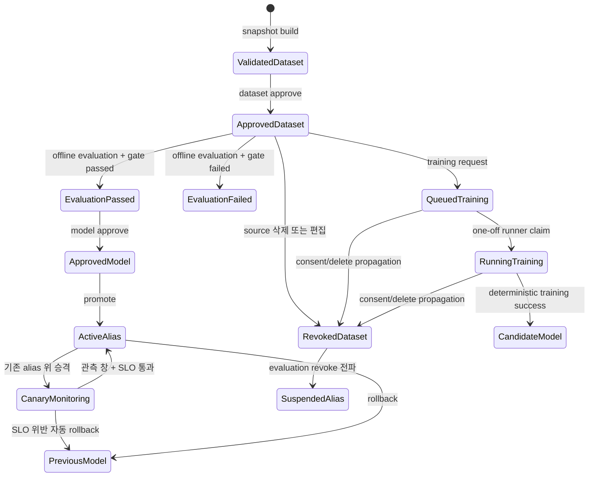

# AI 학습 데이터·평가·모델 승격 API

> 계약의 단일 소스는 `@family/contracts`의 `learning.ts`다. 모든 경로는 전역 prefix
> `/v1`과 Bearer 인증을 사용한다. workspace는 소유자만, household는 owner/admin만
> 변경·조회할 수 있다.
>
> 관련 결정: [ADR-0017 버전·계보 중심 AI 학습 데이터 파이프라인](../adr/0017-versioned-ai-learning-data-pipeline.md)

## 상태 전이



다음 불변식을 서버와 DB가 함께 강제한다.

- dataset, baseline, candidate는 같은 `workspaceId|householdId`와 `task`를 사용한다.
- 평가는 `approved` dataset에만 기록한다. `gateResult`는 요청에서 받지 않고 서버가 계산한다.
- 모델 승인은 `succeeded + passed` 평가가 있어야 한다.
- alias 승격 시 모델 승인, 평가 통과, dataset 현재 승인 상태를 트랜잭션 안에서 다시 확인한다.
- alias 변경은 scope/task/alias advisory lock으로 직렬화하고 append-only revision을 남긴다.
- 기존 alias 위 승격은 canary 정책을 고정한다. 평가는 해당 alias revision에 귀속된 내부 AI trace만
  집계하며 요청 본문으로 오류율·지연 지표를 받지 않는다.
- `rag-embedding` alias 변경은 후보 `model.version` 벡터가 모든 활성 청크에 있어야 하며,
  통과한 immutable embedding projection과 alias를 한 트랜잭션에서 함께 전환한다.
- source 삭제·편집이 dataset을 revoke하면 평가도 revoke하고 그 평가를 쓰는 alias를 `suspended`로 바꾼다.
- dataset 철회는 queued/running/succeeded training run과 로컬 모델까지 revoke/retire하고 private artifact를
  실제 삭제한다.

## 데이터셋

### `POST /v1/learning/datasets/memory-candidate`

확정된 memory candidate feedback으로 immutable Gold snapshot을 만든다.

```json
{
  "workspaceId": "<uuid>",
  "splitSeed": "memory-v2",
  "splitStrategy": "group_time",
  "validationWindowDays": 28,
  "testWindowDays": 14
}
```

split 옵션은 세 dataset builder에 공통이다. `splitStrategy` 기본값은 `group_time`, 기간 기본값은
validation 28일/test 14일이다. `group_hash`를 명시하면 기존 80/10/10 방식으로 생성하며 time window를
함께 보낼 수 없다. 생성 직후 상태는 `validated`다. artifact/manifest object key와 원문은 API로 노출하지
않는다.

### `POST /v1/learning/datasets/merchant-category`

household의 최신 `human_confirmed` 가맹점 규칙을 immutable Gold JSONL로 만든다.

```json
{ "householdId": "<uuid>", "splitSeed": "merchant-category-v2" }
```

- household owner/admin만 생성·조회·승인할 수 있다.
- feature는 정규화된 `merchantPattern`, label은 `categorySlug`와 `categoryId`다.
- 같은 가맹점 target은 최신 확정 시각이 속한 split에만 들어가 train/test 누수를 막는다.
- artifact는 `gold/merchant-category/{householdId}/{version}`에 저장하며 cross-household 결합은 금지한다.
- 확정 규칙의 category가 바뀌면 기존 snapshot과 evaluation을 revoke하고 사용 중 alias를 suspend한다.

### `POST /v1/learning/feedback/rag-retrieval`

workspace owner가 검색 질의와 관련 청크를 명시적으로 확정한다. 자유형식 질의는 DB·로그·응답에 넣지 않고
`learning-inputs/rag-retrieval/...` 객체로 격리하며, DB에는 SHA-256과 현재 chunk revision만 저장한다.

```json
{
  "workspaceId": "<uuid>",
  "query": "장애 대응 런북은 어디에 있나요?",
  "relevantChunkId": "<uuid>",
  "consent": true
}
```

`consent`는 반드시 `true`여야 한다. 같은 workspace/query hash/chunk revision pair는 멱등 재사용한다.
삭제된 청크나 current revision이 없는 청크는 받지 않는다.

### `POST /v1/learning/datasets/rag-embedding`

활성 `human_confirmed|imported_gold` 검색 관련성 피드백을 embedding 검색 offline 평가용 Gold JSONL로 고정한다.

```json
{ "workspaceId": "<uuid>", "splitSeed": "rag-embedding-v2" }
```

- row는 query, query hash, positive chunk revision을 가진다.
- query hash와 positive source chunk의 연결 성분에서 최신 feedback 시각을 구해 전체 성분을 한 split에
  배정한다. 같은 query 또는 source가 train/holdout을 가로지르지 않는다.
- query 객체의 hash가 DB와 다르거나 positive revision이 삭제된 경우 생성을 차단한다.
- source tombstone은 연결 snapshot/evaluation을 revoke하고 질의 객체와 revoke된 Gold artifact/manifest도
  멱등 삭제한다. DB에는 checksum과 계보 감사 정보만 남는다.

`GET /v1/learning/datasets`는 `workspaceId` 또는 `householdId` 중 하나를 받는다.

### `POST /v1/learning/datasets/:datasetSnapshotId/approve`

`validated` snapshot을 평가 가능 상태로 승인한다. 같은 요청은 멱등이다.

승인 직전에 DB에 고정된 `split_group_hash`, event time, split을 다시 집계한다. group/target overlap,
time cutoff 위반, 감사 metadata 누락 중 하나라도 있으면 `400`으로 차단한다. cutoff와 누수 감사 결과는
manifest와 `split_policy`에 저장되며 원본 group key는 저장하지 않는다.
마이그레이션 이전 v1 snapshot item은 감사 필드가 `null`이므로 이미 승인된 snapshot은 유지하되,
아직 `validated` 상태라면 v2 snapshot을 다시 생성한 후 승인해야 한다.

```json
{
  "id": "<dataset uuid>",
  "status": "approved",
  "approvedAt": "2026-07-18T11:00:00.000Z"
}
```

### `POST /v1/learning/datasets/:datasetSnapshotId/revoke`

개인정보 삭제 또는 동의 철회로 dataset과 모든 파생 평가·학습·로컬 모델 artifact를 폐기한다.

```json
{ "reason": "privacy_request" }
```

`reason`은 `privacy_request|consent_withdrawn`이다. dataset/evaluation/training 상태와 모델/alias 차단을
먼저 트랜잭션으로 보존한 뒤 MinIO dataset·manifest·모델 객체를 삭제한다. 저장소 삭제가 완료되지 않으면
`503`을 반환하며 같은 요청은 멱등 재시도할 수 있다.

## Training Runner

### `POST /v1/learning/training-runs`

```json
{ "datasetSnapshotId": "<approved dataset uuid>" }
```

household owner/admin만 요청할 수 있다. `merchant-category`, 승인 상태, `group_time` leakage audit,
사람 라벨 100개, 클래스 3개, 클래스별 10개, 모든 클래스의 train 포함, 세 split 비어 있지 않음을
검사한다. 같은 dataset과 trainer version의 `queued|running|succeeded` run은 멱등 재사용한다.

응답은 `queued` 상태를 반환할 뿐 서버 프로세스를 직접 시작하지 않는다. 운영자는 반환된 UUID를
`TRAINING_RUN_ID`로 [일회성 Runner](../operations/ai-training-runner.md)를 실행한다.

### `GET /v1/learning/training-runs`

query는 `householdId`와 선택 `limit`(기본 50, 최대 100)이다. 실행 상태, dataset/model registry ID,
trainer version, artifact SHA-256, 코드·lockfile·런타임 환경 지문과 train/validation/test accuracy·macro-F1을
최신순으로 반환한다. object key, feature 원문과 exception message는 노출하지 않는다.

## 모델 registry

### `POST /v1/learning/models`

immutable 모델 identity를 `candidate` 상태로 등록한다. 같은 scope/task/provider/model/version의
artifact hash나 dimensions가 다르면 `409`다.

```json
{
  "workspaceId": "<uuid>",
  "task": "memory-candidate",
  "provider": "gemini",
  "model": "gemini-2.5-flash",
  "version": "prompt-v4",
  "artifactHash": "<sha256>",
  "dimensions": 256
}
```

로컬 artifact가 없는 외부 API 모델은 `artifactHash`를 생략할 수 있다. API key와 artifact object
key는 registry에 저장하지 않는다.

### `GET /v1/learning/models`

`workspaceId` 또는 `householdId` 중 하나를 query로 전달한다. `task`는 선택 필터다.

## offline 평가

### `POST /v1/learning/evaluations`

외부 evaluator가 산출한 원문 없는 metric을 기록한다. 전체 또는 slice metric을 사용할 수 있고,
`delta`는 `candidate - baseline`으로 계산한다. 같은 입력·출력·dataset checksum은
`evaluationHash`로 멱등 재사용한다.

```json
{
  "datasetSnapshotId": "<dataset uuid>",
  "baselineModelId": "<baseline uuid>",
  "candidateModelId": "<candidate uuid>",
  "evaluatorVersion": "memory-eval-v2",
  "baselineMetrics": { "accuracy": 0.84, "p95LatencyMs": 120 },
  "candidateMetrics": { "accuracy": 0.88, "p95LatencyMs": 105 },
  "candidateSliceMetrics": {
    "short-message": { "accuracy": 0.82 }
  },
  "criteria": [
    {
      "metric": "accuracy",
      "comparison": "delta",
      "operator": "gte",
      "threshold": 0
    },
    {
      "metric": "accuracy",
      "slice": "short-message",
      "comparison": "candidate",
      "operator": "gte",
      "threshold": 0.8
    },
    {
      "metric": "p95LatencyMs",
      "comparison": "candidate",
      "operator": "lte",
      "threshold": 110
    }
  ]
}
```

metric 누락, baseline 누락, 비유한 수치는 fail-closed다. Zod는 NaN/Infinity를 요청 단계에서 거부하고,
gate 계산기도 이를 다시 방어한다.

## 승인·승격·rollback

### `POST /v1/learning/models/:modelId/approve`

```json
{ "evaluationRunId": "<passed evaluation uuid>" }
```

평가 candidate가 경로의 모델과 다르거나 gate/dataset이 유효하지 않으면 `409`다.

### `POST /v1/learning/models/:modelId/promote`

```json
{
  "evaluationRunId": "<passed evaluation uuid>",
  "alias": "production",
  "canary": {
    "minimumInvocationCount": 20,
    "maximumErrorRateBasisPoints": 500,
    "maximumP95DurationMs": 5000,
    "observationWindowSeconds": 1800
  }
}
```

현재 alias를 원자적으로 바꾸고 revision을 1 증가시킨다. `alias` 기본값은 `production`이다.
기존 alias가 있으면 `model_canary_runs`를 생성한다. `canary`를 생략하면 예시의 서버 기본값을 사용한다.
첫 alias 활성화는 돌아갈 직전 모델이 없으므로 canary run을 만들지 않는다.
`rag-embedding`은 `AI_EMBEDDING_MODEL_REVISION == model.version`, provider/model/dimensions가 일치하는
immutable embedding version의 활성 청크 커버리지가 정확히 100%여야 한다. 활성 청크가 0개여도 fail-closed다.
검사·projection 전환은 RAG publish와 같은 workspace advisory lock을 사용한다. 게이트 결과는
`model_alias_revisions.gate_details`에 감사 정보로 남는다.

### `GET /v1/learning/model-aliases/:alias`

query에 단일 scope와 `task`를 전달한다. 응답 `status`는 `active|suspended`다. serving adapter는
`suspended` alias를 사용하면 안 된다.

### `POST /v1/learning/model-aliases/:alias/rollback`

```json
{ "workspaceId": "<uuid>", "task": "memory-candidate" }
```

현재 revision이 기록한 직전 승인 모델로만 이동한다. 직전 모델이 없거나 그 모델의 승인 평가/dataset이
더 이상 유효하지 않으면 `409`로 차단한다. embedding rollback도 이전 revision 벡터의 100% 커버리지를
재검사하고 online projection과 alias를 함께 복구한다.

### `POST /v1/learning/model-aliases/:alias/canary/evaluate`

```json
{
  "workspaceId": "<uuid>",
  "task": "memory-candidate",
  "expectedRevision": 2
}
```

현재 revision이 요청과 같을 때만 평가한다. 서버는 `ai_invocations` 중 canary의 `aliasId`, revision,
관측 창이 모두 같은 trace만 집계해 오류율(basis point)과 p95 지연을 계산한다.

- 최소 표본 이후 오류율 또는 p95 임계치를 넘으면 관측 창 중에도 즉시 직전 승인 모델로 rollback한다.
- 정상 통과는 관측 창 종료까지 기다린다.
- 관측 창 종료까지 최소 표본이 없으면 안전을 입증하지 못한 것으로 보고 rollback한다.
- 직전 모델의 평가/데이터/embedding coverage도 더 이상 유효하지 않아 rollback할 수 없으면 현재 alias를
  `suspended`로 바꿔 실패 후보의 서빙을 차단한다.
- 다른 변경으로 alias revision이 바뀌었거나 alias가 suspended/superseded 상태면 `409`다.
- 동일 `expectedRevision` 재호출은 이미 `passed|rolled_back`으로 판정됐어도 저장된 결과를 그대로 반환한다.
- rollback revision의 `gateDetails.canaryEvaluation`과 canary run에 판정 근거를 남긴다.

응답 `status`는 `monitoring|passed|rolled_back|suspended`, `trigger`는 `manual|scheduled`다. 이 endpoint는
지표 판정과 rollback을 한 트랜잭션에서 수행한다. `AI_MODEL_CANARY_MONITOR_ENABLED=true`이면 API 제어
평면 monitor가 monitoring canary를 관측 창 종료 시각 순으로 주기 평가한다. 여러 API instance가 같은
run을 보더라도 alias advisory lock과 결정 결과의 멱등 응답이 중복 rollback을 막는다.

### `POST /v1/learning/model-traffic-policies`

```json
{
  "householdId": "<uuid>",
  "task": "merchant-category",
  "alias": "production",
  "candidateModelId": "<uuid>",
  "evaluationRunId": "<uuid>",
  "mode": "shadow",
  "trafficBasisPoints": 2500
}
```

현재는 LLM 경로인 `rag-answer`와 `merchant-category`만 허용한다. 후보는 primary와 달라야 하며 같은
scope/task의 승인 모델이어야 한다. 요청한 평가는 해당 후보의 모델 승인 근거이면서 `succeeded + passed`,
dataset은 현재 `approved`여야 한다. 정책은 현재 alias revision에 고정되고 같은 alias의 기존 활성 정책은
`superseded`된다. `trafficBasisPoints=2500`은 결정적 버킷의 25%를 뜻한다.

- `shadow`: 버킷에 든 요청에서 primary와 후보를 함께 실행하지만 primary 응답만 반환한다. 후보 지연이나
  실패는 사용자 응답을 지연·실패시키지 않는다.
- `live`: 버킷에 든 요청은 후보 응답을 사용한다. 후보 호출이 실패하면 primary를 호출해 응답을 보존한다.

정책 응답은 `id`, alias revision, 후보/evaluation, mode, basis point, 상태와 시각을 반환한다. 결정 salt와
credential은 노출하지 않는다.

### `POST /v1/learning/model-traffic-policies/:policyId/pause`

```json
{ "householdId": "<uuid>", "task": "merchant-category" }
```

활성 정책을 `paused`로 바꾼다. 같은 요청의 재호출은 멱등이다. 이미 다른 정책이나 alias 변경으로
`superseded`된 정책은 `409`다. alias 승격·rollback도 기존 활성 traffic 정책을 자동 supersede한다.

## 운영 지표

### `GET /v1/learning/operations/metrics`

```text
?householdId=<uuid>&windowHours=24
```

활성 household owner/admin만 호출할 수 있다. 선택 household의 outbox·pipeline·AI 토큰·학습 품질과
단일 운영 서버 전체의 BullMQ·경보 집계를 반환한다. 서버 전체 값은 응답에 `scope: "server"`로 표시한다.
학습 품질에는 queued/running/succeeded/failed-or-blocked/revoked Training Runner 수가 포함된다.
원문, 사용자/workspace 식별자, job payload·ID, 오류 메시지는 포함하지 않는다. `windowHours`는 1~168이며
기본값은 24다. 자세한 해석은 [AI 파이프라인 운영 대시보드](../operations/ai-pipeline-dashboard.md)를 본다.

## 런타임 적용 경계

현재 `@family/ai-providers` provider 객체는 프로세스 시작 시 환경변수로 생성된다. model alias는
승격의 권위 있는 제어 평면이지만 임의의 DB 값으로 credential/provider를 동적 생성하지 않는다.
API/Worker runtime resolver는 AI 호출 직전에 scope별 `production` alias를 조회하고 다음을 검사한다.

1. alias `status=active`
2. registry model이 `approved`
3. 연결 evaluation이 `succeeded + passed`, dataset이 현재 `approved`
4. embedding은 registry의 provider/model/version/dimensions와 프로세스 구성 일치

검증 결과의 `aliasId`, revision, `modelRegistryId`는 provider metadata를 통해 원문 없는
`ai_invocations` trace에 함께 기록된다. 세 값은 모두 있거나 모두 없어야 하므로 구성 fallback trace와
alias 기반 trace가 섞이지 않는다.

후보 LLM은 `AI_CANDIDATE_PROVIDER`, `AI_CANDIDATE_LLM_MODEL`,
`AI_CANDIDATE_LLM_MODEL_REVISION`을 함께 설정해 프로세스 시작 시 별도 생성한다. DB 값으로 credential을
동적 생성하지 않는다. runtime resolver는 활성 정책의 후보 provider/model/version을 이 구성과 다시
대조한다. 후보 구성 누락·불일치·평가 무효는 primary-only로 안전하게 폴백하고 원문 없는 경고만 남긴다.
정상 정책 호출은 `trafficPolicyId`, `trafficMode`, `trafficRole`, `trafficBucket`, `trafficSelected`를
`ai_invocations`에 함께 기록한다.

| runtime 경로 | registry task | scope |
|---|---|---|
| RAG 색인·질의 embedding | `rag-embedding` | workspace |
| RAG reranker | `rag-reranker` | workspace |
| 근거 기반 답변 LLM | `rag-answer` | workspace |
| 가맹점 카테고리 제안 | `merchant-category` | household |

alias가 존재하면서 suspended/불일치/평가 무효이면 설정 플래그와 무관하게 fail-closed한다. API는 `503`,
Worker는 잡 실패로 남긴다. alias가 아직 없을 때만 `AI_MODEL_ALIAS_REQUIRED=false`가 현재 provider 구성
사용을 허용한다. 모든 대상 task의 alias를 준비한 뒤 `true`로 전환한다.

RAG 답변은 workspace/user/question을 프로세스 메모리에서 SHA-256으로 만든 key, 가맹점 분류는 이미
가명화된 merchant hash를 routing key로 사용한다. DB와 로그에는 원문 key를 저장하지 않는다. 임베딩은
서로 다른 벡터 공간을 한 index에서 섞을 수 있어 traffic 정책 대상에서 제외했다. reranker는 실제 후보
provider가 추가될 때 동일 resolver/trace 계약으로 확장한다.

## 검증

현재 맥의 운영 PostgreSQL 컨테이너 안에 일회성 DB를 생성해 핵심 상태 전이를 확인한다. 운영 API, Worker,
Web 컨테이너와 운영 `family_memory` DB는 그대로 유지된다.

```bash
node scripts/verify-model-promotion-isolated.mjs
```

오케스트레이터는 `family_memory_verify_<timestamp>_<random>` 이름의 DB만 생성·폐기할 수 있다. migration과
검증이 실패해도 `finally` 정리에서 같은 이름의 DB만 폐기한다. 내부 검증 스크립트도
`NODE_ENV=production`을 항상 거부하며, DB 이름에 `test`, `verify`, `verification` 구분자가 없으면 쓰기
허용 환경변수가 있어도 실행을 차단한다.

통과 평가 첫 승격, 후보 승격,
canary 오류율·p95 위반 자동 rollback, gate 실패 차단, merchant/RAG Gold snapshot, group-aware time split,
누수 감사 metadata 누락 승인 차단, embedding 0/1 차단→1/1 전환→이전 projection rollback, runtime alias
일치/불일치, shadow→live 정책 교체·runtime revision 불일치 차단·pause 수명주기를 검증한다.
