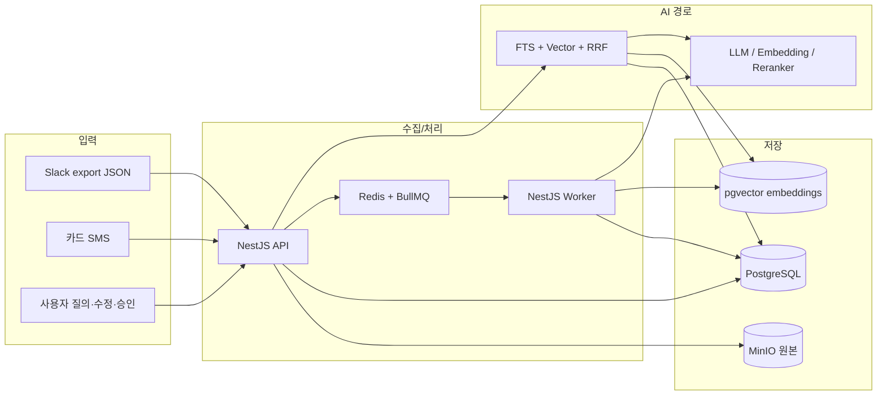
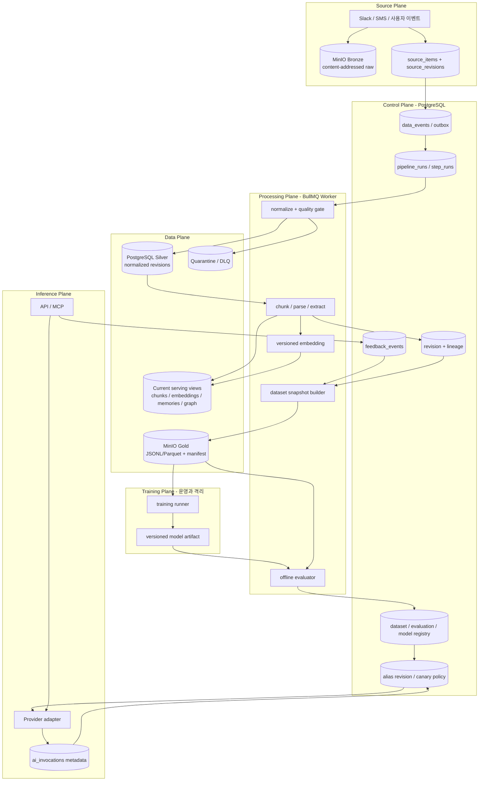
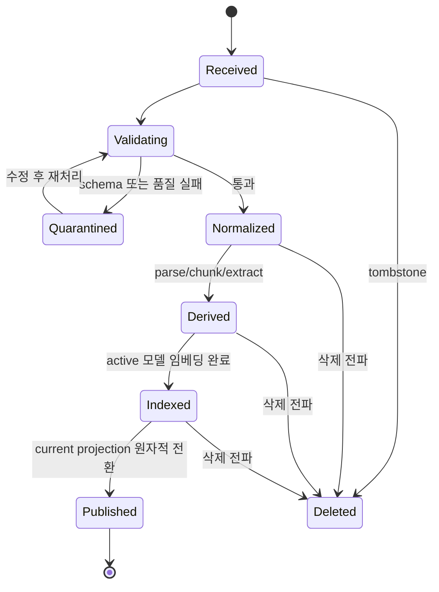

# AI 학습 데이터 파이프라인 — 현행 분석과 목표 설계

> 상태: 기술 로드맵 P0~P3 완료 (실제 운영 학습은 사람 라벨 진입 조건 대기)
> 작성일: 2026-07-19
> 범위: 현재 AI/RAG/분류 파이프라인을 학습·평가 가능한 데이터 플랫폼으로 확장하는 설계
> 관련 결정: [ADR-0017](../adr/0017-versioned-ai-learning-data-pipeline.md),
> [ADR-0018](../adr/0018-deterministic-model-traffic-and-shadow.md),
> [ADR-0019](../adr/0019-merchant-label-review-boundary.md),
> [ADR-0020](../adr/0020-operational-alert-outbox.md),
> [ADR-0021](../adr/0021-pinned-images-and-encrypted-offsite-backup.md),
> [ADR-0022](../adr/0022-isolated-training-runner-and-local-model-artifact.md)

## 0. 결론

현재 시스템은 소규모 개인/가족 서비스에 적합한 **PostgreSQL + pgvector, Redis + BullMQ,
MinIO, NestJS API/Worker** 기반을 이미 갖췄다. 새 Kafka, Airflow, 별도 데이터 웨어하우스를 먼저
도입할 필요는 없다. 지금 필요한 것은 처리량 확장이 아니라 다음 네 가지다.

1. **재현성**: 원본, 정규화 결과, 청크, 임베딩을 버전으로 보존하고 특정 시점의 결과를 다시 만든다.
2. **계보**: 데이터·코드·모델·프롬프트·실행을 하나의 `runId`와 버전 집합으로 연결한다.
3. **신뢰 가능한 라벨**: AI 제안과 사람 확인을 분리하고, 사람 확인만 기본 학습 라벨로 사용한다.
4. **평가 후 배포**: 고정 데이터셋으로 후보를 평가하고 승인된 모델만 서빙 별칭으로 승격한다.

첫 학습 대상은 범용 LLM 미세조정이 아니라 라벨이 명확하고 위험이 낮은 **가맹점 카테고리 분류**와
**검색/메모리 추출 평가**다. 사용자 원문을 여러 workspace에서 모아 하나의 모델을 학습하는 기능은
명시적 동의, 삭제 전파, 재학습 정책을 갖추기 전까지 범위에서 제외한다.

### 구현 상태 — 2026-07-19

- 완료: `pipeline_runs`, `pipeline_step_runs`, `ai_invocations`, `feedback_events` 스키마/마이그레이션
- 완료: Slack/RAG/기억/그래프/카드 파싱/카테고리 제안 worker 실행 계보
- 완료: LLM/Embedding/Reranker 원문 없는 trace와 입력 SHA-256 fingerprint
- 완료: production strict Provider 구성과 silent Mock fallback 차단
- 완료: 검색 시 현재 embedding provider의 model/dim 필터
- 완료: 가맹점 AI prediction과 사용자 확정 feedback 분리
- 완료: `source_revisions`, `chunk_revisions`, `embedding_versions`, `lineage_edges`와 기존 데이터 backfill
- 완료: RAG current projection과 immutable revision 원자적 연결, 동일 입력 재실행 시 revision 재사용
- 완료: workspace 격리 `memory-candidate` JSONL/manifest snapshot과 group split, checksum, 계보 API
- 완료: `data_events` transactional outbox와 Slack/카드 수집→Slack 정규화→RAG BullMQ 발행 경로
- 완료: outbox lease/`SKIP LOCKED`, event 기반 멱등 job id, 지수 재시도와 5회 실패·계약 오류 격리
- 완료: source tombstone→원본 객체·정규화 데이터·RAG/기억 projection 삭제, 영향 dataset revoke
- 완료: owner/admin 범위 격리 event 조회·재처리 API와 재처리 감사 필드
- 완료: Slack 개별 메시지 편집·삭제의 transactional event와 대상 메시지/스레드 RAG 증분 갱신
- 완료: Slack export `merge`/채널 범위 `snapshot` change-set과 재수집 target RAG 증분 갱신
- 완료: RAG publish→기억·그래프 chunk revision outbox fan-out과 stale job 차단
- 완료: 기억 후보/그래프 entity mention·관계의 chunk revision·extractor version 계보와 temporal reconcile
- 완료: evaluation/model registry, 서버 판정 gate, 승인 기반 promotion/rollback alias
- 완료: merchant-category Gold builder와 runtime serving alias resolver
- 완료: 명시적 RAG 관련성 feedback, rag-embedding Gold builder와 100% index coverage 승격/rollback gate
- 완료: alias revision 귀속 호출 trace, canary 관측 창/SLO 판정과 원자적 자동 rollback
- 완료: API 제어 평면 canary 주기 monitor와 manual/scheduled 판정 감사
- 완료: group-aware time split, salted group 감사키와 승인 시 leakage 재검증
- 완료: 승인 후보의 deterministic shadow/live traffic, 원문 없는 할당 trace와 primary fail-safe
- 완료: PostgreSQL/MinIO 일일 논리 백업, checksum manifest와 격리 DB 실제 복구 검증
- 완료: legacy 사람 확정 가맹점 규칙의 append-only feedback 계보 멱등 backfill
- 완료: 원문 없는 merchant-category 학습 준비도 점검과 최소 라벨/클래스 진입 gate
- 완료: 권한·공개범위를 강제하는 가맹점별 사람 라벨 검토 큐와 명시적 확인 UI
- 완료: terminal pipeline failure·outbox quarantine·canary rollback/suspension의 영속 경보 outbox와 외부 웹훅 dispatcher
- 완료: owner/admin 운영 대시보드의 queue depth/age, pipeline failure/p95, AI token/error/p95, 데이터 품질·경보 집계
- 완료: production 이미지 digest pinning과 opt-in restic 오프호스트 암호화 복제·복원 검증 경로
- 완료: 별도 자원 상한을 둔 일회성 Training Runner와 `training_runs` 실행 제어 평면
- 완료: 결정적 문자 n-gram 분류기, dataset/code/lockfile/environment 지문을 포함한 재현 가능 artifact
- 완료: dataset→training run→model registry 계보와 승인 production alias의 로컬 분류·호출 trace
- 완료: dataset 철회/source tombstone의 학습 run·모델·alias·private artifact 폐기 전파
- 완료: 일회성 DB와 실제 MinIO에서 학습 2회 재현성, 로컬 서빙, 삭제 전파 통합 검증

## 1. 범위와 용어

### 목표

- 현재 운영 데이터가 어떤 코드와 모델을 거쳐 결과가 되었는지 역추적한다.
- 동일 원본과 버전 집합으로 데이터셋을 재생성한다.
- 사용자 수정·승인·거절을 append-only 피드백으로 보존한다.
- 개인 정보와 workspace 경계를 지키면서 학습/평가용 스냅샷을 만든다.
- 데이터 품질과 오프라인 평가를 통과한 모델만 운영에 반영한다.
- 삭제·동의 철회가 청크, 임베딩, 데이터셋까지 전파되게 한다.

### 비목표

- 자체 범용 LLM 사전학습
- 실시간 스트리밍 플랫폼 또는 대규모 GPU 클러스터 도입
- 현 단계에서 Kafka, Spark, Airflow, 전용 Feature Store 도입
- AI가 만든 결과를 검증 없이 정답 라벨로 재사용하는 자기학습

이 문서에서 **학습 데이터**는 모델 훈련뿐 아니라 회귀 평가, 프롬프트 평가, 검색 품질 평가에 사용하는
예제를 모두 뜻한다. 임베딩 생성과 RAG 인덱싱은 모델 학습 자체는 아니지만 같은 계보·버전·삭제 규칙을
적용받는 파생 데이터 처리다.

## 2. 현행 아키텍처 분석

### 2.1 확인한 구현 경계

| 영역 | 현행 구현 | 근거 |
|---|---|---|
| 원본 수집 | Slack JSON/카드 문자를 MinIO에 저장하고 `source_items`에 hash와 object key 기록 | [`sourceItems`](../../packages/database/src/schema.ts), [`SlackService`](../../apps/api/src/slack/slack.service.ts) |
| 비동기 처리 | Redis/BullMQ, 공통 3회 재시도와 exponential backoff | [`constants.ts`](../../packages/shared/src/constants.ts) |
| Slack 정규화 | 채널·사용자·메시지·스레드를 PostgreSQL에 적재 | [`slack-import.processor.ts`](../../apps/worker/src/processors/slack-import.processor.ts) |
| RAG 인덱싱 | workspace 전체 메시지를 청크화하고 pgvector 임베딩을 upsert | [`rag-index.processor.ts`](../../apps/worker/src/processors/rag-index.processor.ts) |
| 검색/응답 | trigram FTS + vector + RRF + rerank, 근거가 없으면 앱이 거절 | [`retrieval.service.ts`](../../apps/api/src/retrieval/retrieval.service.ts), [`ai-query.service.ts`](../../apps/api/src/ai/ai-query.service.ts) |
| 기억/그래프 | 청크에서 규칙 기반 후보·관계를 추출하고 사용자가 승인/대체 | [`memory-extract.processor.ts`](../../apps/worker/src/processors/memory-extract.processor.ts), [`graph-extract.processor.ts`](../../apps/worker/src/processors/graph-extract.processor.ts) |
| AI 분류 | 미분류 가맹점을 LLM으로 분류해 `merchant_category_rules`에 반영 | [`category-suggest.processor.ts`](../../apps/worker/src/processors/category-suggest.processor.ts) |
| 모델 경계 | LLM/Embedding/Reranker 인터페이스, Mock/Gemini/OpenAI 일부 구현 | [`factory.ts`](../../packages/ai-providers/src/factory.ts) |
| 운영 | 단일 홈서버 compose, Cloudflare Tunnel, PostgreSQL/MinIO 자동 백업·격리 복구 검증 | [`production-deploy.md`](../production-deploy.md) |

### 2.2 현행 데이터 흐름

첫 Slack 적재는 전체 RAG 인덱싱을 실행하고, 이후 메시지 생성·편집·삭제는 해당 메시지 또는 스레드만
증분 재처리한다. RAG current chunk/embedding publish와 같은 트랜잭션에서 기억·그래프용 revision event를
각각 발행하므로 후속 추출도 해당 chunk revision만 읽는다. 기억·그래프의 별도 API는 운영 복구와 extractor
backfill을 위한 workspace 전체 rebuild로 유지한다.
초기 구조는 기능 검증과 소규모 운영에는 단순하고 안전했지만, revision·lineage 제어 평면 없이 현재값만
upsert하면 특정 입력·코드 버전으로 결과를 재현할 수 없었다.

### 2.3 잘 설계된 부분

- 데이터 소유권을 `workspace.ownerUserId`에서 확인하고 검색 SQL도 workspace로 재스코프한다.
- `source_items`에서 MinIO 원본까지 연결되고 RAG citation과 memory source로 원문을 역추적할 수 있다.
- unique key와 upsert/on-conflict 전략으로 큐 재시도 시 중복을 억제한다.
- LLM이 계산이나 근거 충분성을 결정하지 않고, SQL/앱 로직 결과를 설명하는 역할로 제한된다.
- 원문, prompt, 응답, embedding을 로그에 남기지 않는 정책이 코드 주석과 로거에 반영돼 있다.
- AI Provider 경계가 모델 교체 지점을 한 패키지로 모은다.
- 모듈러 모놀리스이므로 새 제어 평면을 별도 분산 시스템 없이 추가할 수 있다.

## 3. 핵심 격차와 위험

| 우선순위 | 격차 | 현행 영향 | 필요한 보완 |
|---|---|---|---|
| P0 | 버전 없는 제자리 갱신 | 청크·임베딩 과거 상태와 데이터셋을 재현할 수 없음 | `source/chunk/embedding revision`과 immutable manifest |
| P0 완료 | 서빙 임베딩 모델 혼합 가능 | model/dim 조회 필터와 immutable version을 적용하고 alias 전환 전 100% 커버리지 및 projection 원자 전환을 강제함 | 운영 drift/canary 관측 유지 |
| P0 | AI 제안과 사람 라벨 혼합 | `merchant_category_rules.createdBy=null`만으로 자동 생성 원인·모델·확정 여부를 충분히 구분하지 못함 | append-only `feedback_events`, `labelSource`, prediction/confirmation 분리 |
| P0 | 실행/호출 계보 부재 | 모델·프롬프트·코드·입력 버전별 비용, 실패, 품질 비교 불가 | `pipeline_runs`, `pipeline_step_runs`, `ai_invocations` |
| P0 | 프로덕션 Mock 자동 폴백 | provider 키/구성이 잘못돼도 기능이 성공처럼 보이고 품질이 조용히 바뀔 수 있음 | production fail-closed 또는 명시적 degraded 상태 |
| P1 완료 | export 변경 집합 미식별 | 기본 `merge`와 명시적 채널 범위 `snapshot`을 분리하고 tombstone 재생성을 차단함 | change-set별 target outbox event와 재시도 멱등성 유지 |
| P1 완료 | 일부 전체 workspace 재처리 | RAG publish가 기억·그래프용 chunk revision event를 발행하고 consumer가 stale revision을 거부함 | 수동 전체 API는 복구/backfill 경로로 유지 |
| P1 완료 | DLQ/격리·재처리 부재 | outbox 격리, 오류 코드, owner/admin 조회·재처리 API와 영속 외부 경보를 구현함 | 웹훅 target 구성과 5분 이내 전달 SLO 유지 |
| P1 완료 | 추출기/프롬프트 버전 부재 | revision과 extractor/prompt/model version 계보를 구현함 | 신규 extractor의 이전 승인 상태 회귀 검증 유지 |
| P1 완료 | 데이터 삭제 계보 부재 | lineage edge, tombstone 전파와 영향 dataset revoke를 구현함 | backup retention 내 삭제 검증 유지 |
| P2 완료 | 데이터셋/평가/레지스트리 부재 | snapshot, evaluation gate, 승인, alias 승격·rollback을 구현함 | 실제 운영 baseline과 품질 threshold 확정 |
| P2 완료 | 운영 관측성 부족 | 원문 없는 trace, canary monitor, 영속 외부 경보, queue/lag/token-cost-proxy/quality 대시보드, 자동 백업·격리 복구 검증을 구현함 | 실제 webhook target과 모델별 가격표 version 운영 설정 |

production 외부 이미지는 검증된 OCI digest로 고정했다. 자동 백업, 격리 복구 검증과 restic 암호화 2차
복제 경로도 구현했으며, 단일 디스크 장애까지 실제 대응하려면 운영자가 맥 본체와 장애 도메인이 다른
`RESTIC_REPOSITORY`와 credential을 연결해야 한다.

## 4. 설계 원칙

1. **현재 스택 우선**: Postgres는 메타데이터/상태/계보, MinIO는 immutable 원본과 데이터셋 artifact,
   BullMQ는 실행 오케스트레이션을 담당한다.
2. **현재값과 이력 분리**: API가 읽는 current projection과 재현용 append-only revision을 분리한다.
3. **명시적 버전**: 파서, 청커, redaction, label schema, prompt, model, code SHA를 문자열 버전으로 남긴다.
4. **사람 라벨 우선**: AI prediction은 정답이 아니다. `human_confirmed`만 기본 학습 집합에 포함한다.
5. **workspace 격리 기본**: 학습/평가는 workspace 내부가 기본이고 cross-workspace 사용은 별도 opt-in이다.
6. **원문 최소화**: trace 테이블에는 원문 대신 fingerprint와 집계만 저장한다. 학습 artifact는 최소 권한,
   암호화, 짧은 retention을 적용한다.
7. **삭제 가능성 내장**: 모든 예제는 source revision까지 역추적되어야 하며, 삭제 요청이 파생물에 전파된다.
8. **평가 없는 승격 금지**: 데이터 품질과 baseline 비교를 통과하지 않은 모델은 active alias를 얻지 못한다.

## 5. 목표 아키텍처

### 5.1 Bronze: 변경 불가능한 원본과 수집 manifest

- MinIO object key를 `bronze/{sourceKind}/{sha256-prefix}/{sha256}` 형태의 content-addressed key로 둔다.
- `source_items`는 현재 개념을 유지하고 `source_revisions`에서 source locator, content hash, 수집 시각,
  parser schema, 동의 snapshot, 삭제 시각을 append-only로 보존한다.
- 같은 hash 재수집은 새 blob을 만들지 않되, 별도 수집 event와 workspace 연결은 남긴다.
- 원본 validation 실패는 버리지 않고 quarantine 사유와 함께 격리한다.
- Slack 편집/삭제는 새 revision/tombstone으로 표현하고 이전 정규화 결과를 닫는다.

### 5.2 Silver: 버전이 있는 정규화·파생 데이터

- `slack_messages`, `card_sms_events`, `chunks`는 current projection으로 유지한다.
- 재현 이력은 `normalized_revisions` 또는 도메인별 revision 테이블에 저장한다.
- `chunk_revisions`는 `chunkId`, `revision`, `contentHash`, `chunkerVersion`, `redactionVersion`,
  `sourceRevisionIds`, `validFrom`, `validUntil`, `runId`를 가진다.
- 입력 hash와 transform version이 같으면 재사용하고, 둘 중 하나라도 바뀌면 새 revision을 만든다.
- 새 revision publish와 이전 current 종료는 한 트랜잭션에서 처리한다.

### 5.3 Serving projection: 모델 혼합 방지

- `embedding_versions`의 유일키는 `(chunkRevisionId, modelId, preprocessingVersion)`이다.
- `model_registry`에는 scope, task, provider, model name/revision, dimensions, artifact hash, 상태를 저장한다.
- 검색은 `model_aliases(scope, task, alias='production')`가 가리키는 `modelRegistryId`와 suspension을
  확인하고 해당 model/dimensions로 반드시 필터한다.
- 다른 차원의 모델은 같은 pgvector 컬럼에 섞지 않는다. 현재 256차원 계약을 유지하거나 별도 인덱스를
  만든 뒤 원자적으로 alias를 전환한다.
- 재임베딩 중에는 기존 active index가 계속 요청을 처리하고, coverage와 품질 gate 통과 후 새 index로
  전환한다.

### 5.4 Gold: immutable 데이터셋 스냅샷

- 데이터셋은 MinIO `gold/{task}/{datasetVersion}/` 아래 JSONL 또는 Parquet과 manifest로 저장한다.
- manifest는 dataset schema, query/label policy, transform versions, source revision hash 목록,
  split seed/전략, row count, checksum, 생성 `runId`, 동의 범위를 포함한다.
- `dataset_snapshots`는 artifact 위치와 상태(`draft`, `validated`, `approved`, `revoked`)만 관리한다.
- dataset version은 내용을 덮어쓰지 않는다. 라벨/정책 변경은 새 version을 만든다.
- 삭제 대상 source가 포함되면 snapshot을 `revoked`로 전환하고 재생성한다.
- 첫 구현은 owner-only `POST /v1/learning/datasets/memory-candidate`와
  `GET /v1/learning/datasets?workspaceId=...`이다. artifact에는 원문을 복사하지 않고 확정 feedback,
  `chunkRevisionId`, split만 저장하며 API 응답에는 MinIO object key를 노출하지 않는다.
- offline 평가 전 `POST /v1/learning/datasets/:id/approve`로 `validated→approved`를 명시한다.
- household 가맹점 분류는 `human_confirmed` 규칙의 정규화 merchant feature와 category slug를 Gold
  JSONL로 고정한다. target 단위 group split을 사용하며 cross-household artifact를 만들지 않는다.
- RAG 검색 평가는 owner가 `consent=true`로 확정한 query–positive chunk pair만 사용한다. 질의 원문은
  전용 object에 격리하고 DB에는 hash와 chunk revision을 보존한다. Gold row의 같은 query hash는 하나의
  split에만 배정한다.

### 5.5 모델 평가·승격 제어 평면

- `evaluation_runs`는 dataset checksum, baseline/candidate identity, evaluator version, 전체/slice metric,
  기준과 서버 판정 상세를 immutable하게 보존한다.
- gate 기준은 candidate 절대값 또는 `candidate-baseline` delta에 `gte|lte`를 적용한다. 누락 metric과
  비유한 수치는 fail-closed다.
- `model_registry` identity는 scope/task/provider/model/version으로 고정하며 승인 상태만 전이한다.
- `model_aliases`는 현재 projection, `model_alias_revisions`는 append-only 변경 감사 이력이다. 승격과
  rollback은 scope/task/alias advisory lock 안에서 revision을 증가시킨다.
- source 삭제·편집으로 dataset이 revoke되면 연결 평가를 revoke하고 그 평가를 쓰는 alias를 suspend한다.
- provider factory는 시작 시 환경변수로 생성된다. API/Worker resolver는 AI 호출 전에 scope별 alias의
  suspension, 모델 승인, evaluation/dataset 유효성, provider/model/version/dimensions 일치를 검사한다. alias가
  존재하면서 불일치하면 API 503 또는 Worker 잡 실패로 처리한다.
- alias 미등록 rollout 기간에만 `AI_MODEL_ALIAS_REQUIRED=false`로 현재 구성을 허용한다. alias가 존재하면
  이 플래그와 무관하게 검증한다. 전체 task 준비 후 `true`로 전환한다.
- `rag-embedding` 승격/rollback은 registry `version`과 같은 `embedding_versions.model_revision`이 활성
  chunk revision 전체를 덮는지 검사한다. 0개 workspace와 부분 coverage는 차단하고, 통과 시 해당 벡터를
  `embeddings` current projection으로 게시하는 변경과 alias revision을 한 트랜잭션에서 커밋한다. RAG
  publish와 같은 workspace advisory lock으로 coverage 검사 중 current projection 변경을 직렬화한다.
- 기존 alias 위 승격은 `model_canary_runs`에 최소 호출 수, 최대 오류율, 최대 p95 지연과 관측 창을
  고정한다. runtime resolver가 반환한 alias/model revision을 provider metadata와 `ai_invocations`에
  함께 기록하므로 다른 scope·과거 revision 호출은 canary 집계에 섞이지 않는다.
- canary 판정은 내부 trace 집계만 신뢰한다. 최소 표본 이후 SLO 위반은 즉시, 관측 창 종료 시 표본 부족은
  fail-closed rollback한다. 판정과 직전 모델 rollback은 alias advisory lock을 잡은 한 트랜잭션에서
  수행하고 rollback revision에 근거를 남긴다. 직전 모델이 더 이상 유효하지 않으면 현재 alias를 suspend한다.
  source revoke로 alias가 suspend되면 canary도 supersede한다.
- API 제어 평면 monitor는 설정된 주기와 batch 크기로 monitoring run을 평가한다. 판정 trigger를
  `manual|scheduled`로 남기며, 중복 poll은 alias advisory lock과 idempotent 결과로 흡수한다.
- `model_traffic_policies`는 현재 alias revision에 승인 후보와 평가 근거, `shadow|live`, basis point,
  결정 salt를 고정한다. 후보 runtime은 환경변수로 별도 생성하고 resolver가 provider/model/version을
  다시 대조한다. DB 값으로 credential이나 provider를 동적 생성하지 않는다.
- SHA-256 버킷은 같은 정책과 가명 routing key를 항상 같은 역할로 배정한다. shadow는 후보 결과를
  폐기하며, live 후보 오류는 primary로 폴백한다. alias revision 변경은 기존 정책을 supersede한다.
- 현재 traffic 대상은 `rag-answer`, `merchant-category` LLM이다. embedding은 vector 공간 혼합 위험으로
  제외하며 reranker는 실제 후보 구현체가 준비된 뒤 같은 계약으로 확장한다.

### 5.6 실행 제어와 계보

최소 제어 테이블은 다음과 같다.

| 테이블 | 핵심 필드 | 역할 |
|---|---|---|
| `data_events` | eventId, aggregateType/Id, eventType, revisionId, occurredAt, publishedAt | DB outbox와 증분 처리 입력 |
| `pipeline_runs` | runId, pipelineName/Version, scope, trigger, codeSha, configHash, status, watermark | 파이프라인 1회 실행 |
| `pipeline_step_runs` | runId, stepName/Version, attempt, input/output/reject counts, metrics, errorCode | 단계별 상태·재시도·품질 |
| `lineage_edges` | fromType/Id/Revision, toType/Id/Revision, runId | source→chunk→embedding→example 역추적 |
| `ai_invocations` | traceId, alias/model revision, traffic policy/role/bucket, fingerprint, latency, outcome | revision·할당 귀속 원문 없는 AI 호출 관측 |
| `feedback_events` | target, predictionRef, labelSchemaVersion, label, source, actor, occurredAt | 사람/시스템 피드백 이력 |
| `rag_retrieval_examples` | workspace, feedbackId, chunkRevisionId, queryObjectKey/Hash, revokedAt | 명시적 opt-in 검색 질의와 positive revision 계보 |
| `dataset_snapshots` | task, version, manifestKey/Hash, splitPolicy, consentScope, status | 재현 가능한 학습/평가 집합 |
| `training_runs` | datasetId, code/environment digest, seed, hyperparameters, artifactHash, status | 격리된 학습 실행 재현 |
| `evaluation_runs` | datasetId, baselineModelId, candidateModelId, metrics/slices, gateResult | 모델 비교와 승격 근거 |
| `model_registry` | scope, task, provider/model/version, artifactHash, status | immutable 모델 identity와 승인 |
| `model_aliases` | scope, task, alias, modelId, revision, suspension | 현재 승격 projection |
| `model_alias_revisions` | aliasId, revision, previous/current model, evaluationId, gateDetails | 승격·rollback과 runtime gate 감사 이력 |
| `model_canary_runs` | aliasId/revision, 관측 창/SLO, 집계, 판정, rollbackRevision | post-promotion canary 정책과 결정 감사 |
| `model_traffic_policies` | aliasId/revision, candidate/evaluation, mode, basisPoints, salt, status | deterministic shadow/live 할당 정책 |
| `deletion_requests` | subject/source, requestedAt, per-layer status, completedAt | 삭제 전파 증적 |

`lineage_edges`를 처음부터 모든 행 단위로 만들면 비용이 커질 수 있다. 초기에는 source/chunk/dataset example처럼
삭제와 평가에 필요한 경계만 행 단위로 연결하고, 동일 배치 내부 관계는 manifest hash 목록으로 압축한다.

## 6. 증분 처리 상태 머신

- API 트랜잭션은 도메인 변경과 `data_events` insert를 함께 커밋한다.
- dispatcher가 unpublished event를 BullMQ에 전달하고 성공 후 `publishedAt`을 기록한다.
- dispatcher가 enqueue 성공 후 중단되어 같은 event를 다시 보낼 수 있으므로 전달은 at-least-once로 보고,
  consumer 멱등키로 중복을 흡수한다.
- outbox 발행 job id는 `outbox_{eventId}`로 고정하고, 별도 backfill/내부 step job은
  `pipeline_step + revisionId + stepVersion`의 안정적 hash를 사용한다.
- step은 입력 revision과 version 조합에 대해 멱등이어야 한다.
- 같은 aggregate의 revision은 단조 증가시킨다. BullMQ 도착 순서를 신뢰하지 않고 stale revision은 publish하지 않는다.
- 처리 성공 전에 watermark를 전진시키지 않는다.
- 3회 실패 후 `pipeline_step_runs.status='quarantined'`로 전환하고 원인 코드와 재처리 가능 여부를 남긴다.
- 전체 workspace rebuild는 운영 복구와 버전 마이그레이션용 별도 pipeline으로 유지한다.

현재 구현된 outbox route는 `source.slack.received.v1`→`slack-import`,
`source.card_sms.received.v1`→`card-sms-parse`, `slack.normalized.v1`→전체 `rag-index`,
`slack.message.changed.v1`→대상 `rag-index`, `source.tombstoned.v1`→`source-tombstone`,
`rag.chunk.memory-ready.v1`→대상 `memory-extract`, `rag.chunk.graph-ready.v1`→대상 `graph-extract`다. Dispatcher는 2초마다
최대 25건을 가져오고 60초 lease를 사용한다. 일시 오류는 최대 5회 exponential backoff로 재시도하며,
알 수 없는 event type이나 payload 계약 오류는 재시도로 해결되지 않으므로 즉시 `quarantinedAt`을 기록한다.
BullMQ job id는 `outbox_{eventId}`로 고정해 enqueue 성공 후 DB 반영 전에 중단돼도 중복 job 생성을 막는다.

삭제는 `DELETE /v1/learning/sources/:sourceItemId`로 요청한다. workspace source는 owner, household source는
owner/admin만 실행할 수 있다. API는 source projection, tombstone revision, outbox event를 한 트랜잭션으로
커밋한다. Worker는 이전 revision의 object key를 멱등 삭제하고 Slack 메시지 또는 카드 원문을 정리한다.
lineage로 찾은 descendant chunk는 개인정보 누출을 막기 위해 보수적으로 tombstone 처리하고 online
embedding을 제거하며, 연결된 memory를 삭제하고 dataset snapshot을 `revoked`로 전환한다. 계보 식별자는
영향 분석용으로 유지하지만 과거 chunk/memory 본문은 비운다. 삭제 청크에 연결된 RAG relevance example도
revoke하고 별도 저장한 query 객체를 멱등 삭제한다.
영향 snapshot의 Gold artifact/manifest도 object storage에서 삭제하고 DB에는 checksum·계보 감사 정보만 유지한다.

격리 event는 `GET /v1/learning/outbox/quarantined`에서 scope별로 조회하고
`POST /v1/learning/outbox/:eventId/reprocess`로 재처리한다. payload는 API 응답에 노출하지 않으며,
재처리는 retry budget과 lease를 초기화하고 `reprocessCount`, 요청자, 요청 시각을 감사 필드로 남긴다.

개별 메시지는 owner-only `PATCH /v1/slack/messages/:id`와 `DELETE /v1/slack/messages/:id`로 변경한다.
API는 current message projection과 `slack.message.changed.v1`을 한 트랜잭션에 기록하고, event id를 변경
revision 및 대상 청크 계보 식별자로 사용한다. Worker는 지정된 standalone message 또는 thread만 다시 읽는다.
편집 시 이전 chunk revision은 감사 이력으로 유지하되 영향 dataset snapshot과 memory projection을 무효화하고,
삭제 시에는 online embedding을 제거하고 과거 청크·임베딩 본문을 비운 뒤 활성 메시지가 없으면 tombstone
revision을 발행한다.

Slack export import의 multipart `syncMode`는 기본 `merge`와 명시적 `snapshot`을 지원한다. `merge`는 bundle에
있는 생성·편집만 반영하고 누락 행을 보존한다. `snapshot`은 bundle의 `channels[]`에 명시된 채널만 완전본으로
간주해 그 채널의 누락된 활성 메시지를 삭제한다. 이미 tombstone인 메시지는 어느 모드에서도 복구하지 않는다.
현재 `editedTs`보다 version이 없거나 오래된 수신 편집도 stale change로 무시해 out-of-order export가 최신
projection을 덮지 못하게 한다.
첫 import는 `slack.normalized.v1` 전체 build를 한 번 실행하고, 이후 import는 메시지 본문·스레드 소속·작성자명·
채널명 변화로 영향을 받는 target을 dedupe해 `slack.message.changed.v1`만 발행한다. 동일 source revision 재시도는
이미 반영된 projection에서 빈 change-set이 되므로 새 event를 만들지 않는다.

RAG는 embedding current projection을 전환할 때 advisory lock 아래 chunk의 `currentRevisionId`를 다시 확인한다.
최신 revision인 binding에 대해서만 기억·그래프 event를 같은 트랜잭션에 기록한다. 두 consumer도 같은 lock과
`currentRevisionId`를 재검증해 BullMQ 도착 순서와 무관하게 stale 잡을 no-op 처리한다. 기억 후보의 identity는
`chunkRevisionId + extractorVersion + type + subjectHash`이며, 그래프는 `graph_entity_mentions`와 자동 관계에
chunk/revision/extractor provenance를 기록한다. 새 revision에서는 편집 전 후보를 거절하고, 이전 mention·관계는
삭제 대신 `validUntil`로 마감한다. tombstone은 기억 본문을 비우고 그래프 current 파생물을 모두 종료한다.

## 7. 피드백과 학습 데이터 정의

### 7.1 공통 라벨 규칙

`feedback_events.source`는 최소 다음 값을 구분한다.

- `human_confirmed`: 사용자가 명시적으로 승인하거나 수정한 정답
- `human_rejected`: 사용자가 명시적으로 거절한 결과
- `system_rule`: 결정적 규칙 결과
- `model_prediction`: 모델이 낸 제안, 정답으로 사용하지 않음
- `imported_gold`: 검토된 외부/수동 기준 데이터

학습 데이터셋의 기본 포함 기준은 `human_confirmed`와 검증된 `imported_gold`다. `system_rule`은 평가용
silver label 또는 weak supervision으로만 쓰며 별도 slice로 측정한다. `model_prediction`을 다시 정답으로
사용하지 않는다.

### 7.2 우선 학습/평가 태스크

| 순서 | 태스크 | 입력 | 라벨 | split/leakage 규칙 | 핵심 지표 |
|---|---|---|---|---|---|
| 1 | 가맹점 카테고리 분류 | redacted merchant + 허용된 문맥 | 사용자가 확정한 category | 동일 merchant hash는 한 split, 시간 holdout | macro F1, class recall, abstain rate |
| 2 | 기억 후보 추출 | chunk revision | 승인/거절/수정된 type·subject·content | 동일 thread/source는 한 split, workspace 격리 | precision/recall, approval rate, edit distance |
| 3 | RAG 검색 | query + candidate chunk ids | relevant ids, answerable/refusal | 동일 thread는 한 split, 최신 기간 time holdout | Recall@K, MRR, refusal precision/recall |
| 4 | 답변 품질 | query + retrieved ids + answer | 도움됨, citation 오류, 사실 오류 | query/source group split | groundedness, citation precision, preference win rate |
| 5 | 그래프 추출 | chunk revision | 확정 entity/relationship/supersede | source thread group split | entity/relationship F1, temporal accuracy |

공개 dataset builder의 기본 정책은 `group_time`이다. snapshot에서 가장 최신 event를 기준 시각으로 삼고
직전 14일을 test, 그 앞 28일을 validation, 나머지를 train으로 둔다. 같은 group의 row가 여러 기간에
걸치면 group의 **최신 event**가 속한 split로 전부 이동한다. 따라서 오래된 row가 holdout에 포함될 수는
있지만 미래에 다시 등장한 group이 train에 남는 누수는 발생하지 않는다. 기간은 API 요청으로 조정할 수
있고, 재현된 cutoff는 manifest와 `dataset_snapshots.split_policy`에 고정한다.

RAG는 query hash와 positive source chunk를 양쪽 group key로 사용한다. 같은 source를 공유하는 서로 다른
query와 같은 query가 가리키는 서로 다른 source를 연결 성분으로 묶어 전체 성분을 한 split에 배정한다.
원본 group key는 저장하지 않고 seed를 포함한 SHA-256 `split_group_hash`만 snapshot item에 기록한다.
builder는 group/target overlap과 time cutoff 위반을 0건으로 검증하며, snapshot 승인 API가 DB item을 다시
집계해 같은 검사를 통과하지 못한 snapshot을 차단한다. 기존 hash 80/10/10은 명시적 `group_hash` 전략으로
호환하되 신규 snapshot 기본값으로 사용하지 않는다.

금융 질의의 합계와 예산 계산은 계속 SQL을 진실로 유지한다. 여기서 학습 가능한 부분은 자연어 intent와
표현 품질뿐이며, 금액 계산 모델을 별도로 만들지 않는다.

### 7.3 카테고리 자기학습 보완

현재 LLM 제안은 규칙을 저장하고 기존 미분류 거래까지 갱신한다. 다음처럼 분리한다.

1. 모델 결과는 `category_predictions` 또는 `feedback_events(source='model_prediction')`에 저장한다.
2. 신뢰 임계값 이상도 기본은 `suggested`이며, 사용자 확인 전 `human_confirmed`가 아니다.
3. `merchant_category_rules`에 `source`, `modelId`, `predictionId`, `confirmedBy`, `confirmedAt`을 추가한다.
4. 사용자 수정은 기존 규칙을 덮어쓰기보다 append-only feedback을 남기고 current rule을 갱신한다.
5. 데이터셋 builder는 최종 확정 라벨과 과거 prediction을 함께 묶어 오류 분석이 가능하게 한다.

## 8. 평가, 승격, rollback

후보 모델은 다음 순서로만 운영에 들어간다.

1. 승인된 dataset snapshot을 고정한다.
2. baseline과 candidate를 같은 입력, 같은 seed, 같은 slice로 평가한다.
3. 전체 지표와 민감 slice(workspace, 희소 category, 긴 thread, 최신 기간)를 함께 비교한다.
4. 승인 후보를 shadow 정책으로 일부 요청에 실행하고 사용자 응답에는 노출하지 않는다.
5. 원문 없는 후보 trace가 안전 기준을 만족하면 작은 비율의 live 정책으로 전환한다.
6. 운영 전환을 결정하면 active alias를 candidate로 승격하고 post-promotion canary 관측 창을 연다.
7. 해당 alias revision의 오류율·p95 지연을 관측하고 실패하면 이전 alias로 즉시 rollback한다.

초기 gate 제안은 다음과 같다. 실제 수치는 첫 baseline 측정 후 ADR 또는 운영 설정으로 확정한다.

- 데이터셋 schema/lineage/consent 검증 오류 0건
- baseline 대비 핵심 지표 회귀 없음, 중요 slice 급락 없음
- RAG 답변 citation coverage 100%, SQL 기반 금융 답변 수치 불일치 0건
- embedding index coverage 100% 후 alias 전환
- production provider 오류율·p95 latency가 현재 SLO 이내

## 9. 개인 정보, 동의, 삭제

- 기본 정책은 **workspace 내부 평가와 개인화**다. cross-workspace 학습은 별도 동의 목적과 보존 기간을
  명시하고 각 사용자가 독립적으로 철회할 수 있어야 한다.
- household 기능 동의와 모델 학습 동의를 같은 값으로 재사용하지 않는다.
- 학습 artifact에는 이메일, Slack user id, 실명, 카드 식별자, 정확한 object key를 직접 넣지 않는다.
  필요한 그룹 키는 회전 가능한 scope별 HMAC으로 가명화한다.
- `ai_invocations`에는 prompt/response 원문을 저장하지 않는다. 품질 표본이 꼭 필요하면 opt-in 데이터만
  `learning_payloads`가 가리키는 별도 암호화 bucket에 짧게 보관하고 접근을 감사한다. 일반 trace와
  학습 payload를 분리해 관측성 기능이 원문 수집 기능으로 변하지 않게 한다.
- MinIO의 bronze/gold bucket은 분리하고 worker 역할별 최소 권한 credential을 사용한다.
- 삭제 요청은 raw manifest → normalized revision → chunk → embedding → dataset example을 따라 전파한다.
- 삭제 source가 포함된 dataset과 평가 결과는 `revoked`로 표시한다. cross-workspace fine-tuned model까지
  삭제를 보장할 수 없다면 해당 학습 기능을 시작하지 않거나 전체 재학습/폐기 정책을 먼저 마련한다.
- 백업에서도 retention 만료 후 삭제가 보장되도록 backup catalog와 복구 절차에 삭제 정책을 포함한다.

초기 보존 정책 제안은 raw 30일, 호출 메타데이터 90일, quarantine 14일이다. 서비스 기능에 필요한
정규화 current 데이터와 사용자가 승인한 기억은 계정/동의 기간 동안 유지하되, 이 수치는 제품 정책 확정 후
설정값으로 관리한다.

## 10. 데이터 품질과 운영 SLO

### 데이터 품질 검사

- schema/version 적합성, 필수 키, timestamp 범위, content hash 일치
- workspace/household 소유 스코프 누락 0건
- source revision 없는 current row 0건
- active chunk revision당 active embedding 정확히 1건
- embedding dimension/model alias 일치 100%
- dataset example의 source lineage와 label source 존재 100%
- train/validation/test group overlap 0건
- deleted/revoked source가 새 snapshot에 포함된 건수 0건

### 초기 운영 목표

| 항목 | 초기 목표 |
|---|---|
| 수집 완전성 | 승인된 source event 대비 terminal 상태 99.9% 이상 |
| 인덱스 신선도 | 정상 import 완료 후 active index publish p95 10분 이내 |
| 삭제 전파 | 요청 후 serving index 24시간 이내 제거 |
| 재현성 | 승인 dataset manifest checksum 재생성 일치 100% |
| 실패 가시성 | terminal failure 5분 이내 경보, 미처리 quarantine 24시간 초과 0건 |
| 백업 | 일일 자동 백업, 월 1회 복구 검증 |

필수 metric은 queue depth/age, step duration/failure/retry, source→publish lag, rows in/out/rejected,
provider latency/error/token/cost, active model/index coverage, dataset label 분포, offline quality와 feedback rate다.
metric label에는 원문, user id, workspace id처럼 cardinality·개인 정보가 큰 값을 넣지 않는다.

## 11. 단계별 도입 계획

### P0 — 안전한 관측과 모델 일관성

- `pipeline_runs`, `pipeline_step_runs`, `ai_invocations` 추가
- 모든 processor와 AI 호출에 `runId/traceId`, code SHA, model/prompt/extractor version 기록
- production에서 provider 구성 오류 시 silent Mock 폴백 금지; readiness에 degraded 원인 표시
- embedding 조회를 active model id로 필터하고 현재 index의 model 혼합 검사 추가
- category prediction과 human confirmation을 분리하고 append-only feedback 시작
- 완료: BullMQ terminal failure 조회/재처리
- 완료: terminal failure·quarantine·canary rollback/suspension 경보 outbox와 generic/Slack 웹훅 dispatcher
- 운영 설정: 실제 5분 이내 통지를 위해 `PIPELINE_ALERT_WEBHOOK_URL` target 연결

완료 조건: 한 AI 응답에서 source revision, chunk revision, embedding model, prompt version, 실행 run까지
역추적할 수 있고 원문 없이 비용·지연·오류를 집계할 수 있다.

### P1 — revision, 증분 처리, 삭제 전파

- 완료: `source_revisions`, `chunk_revisions`, `embedding_versions`, `lineage_edges` 추가와 기존 행 backfill
- 완료: RAG current projection이 immutable chunk/embedding revision을 가리키고 source 계보를 기록
- 완료: `data_events`와 DB outbox→BullMQ dispatcher 구현
- 완료: Slack·카드 수집 및 Slack normalized 후속 처리를 outbox route로 전환
- 완료: source 단위 삭제를 revision/tombstone으로 반영하고 downstream privacy projection 전파
- 완료: Slack 개별 편집/삭제를 메시지·스레드 대상 revision으로 반영
- 완료: Slack export import를 `merge`/채널 범위 `snapshot` change-set과 target RAG 처리로 전환
- 완료: 기억·그래프의 전체 workspace scan을 변경 chunk revision 중심 처리로 전환
- 완료: quarantine 조회와 재처리 API 구현
- 완료: automated PostgreSQL/MinIO backup, checksum과 격리 PostgreSQL 실제 복구 검증

완료 조건: 한 메시지 수정/삭제가 전체 rebuild 없이 downstream current projection까지 반영되고, 이전
버전은 manifest로 재현된다.

### P2 — 데이터셋과 오프라인 평가

- 완료: `dataset_snapshots`, `dataset_snapshot_items`와 memory extraction dataset builder
- 완료: MinIO Gold JSONL/manifest checksum, workspace-only group split
- 완료: `evaluation_runs`, `model_registry`, `model_registry_approvals`
- 완료: 서버 판정 전체/slice gate, dataset/model 승인, named alias promotion/rollback
- 완료: dataset revoke 시 evaluation revoke와 active alias suspension 전파
- 완료: household-only merchant-category Gold builder와 target group leakage 방지
- 완료: RAG embedding/reranker/answer와 merchant-category runtime alias resolver
- 완료: 가맹점 규칙 label 변경 시 dataset/evaluation revoke와 alias suspension
- 완료: 명시적 query–positive chunk revision feedback과 rag-embedding Gold builder
- 완료: model revision별 embedding index 100% coverage gate와 projection/alias 원자적 승격·rollback
- 완료: alias revision trace와 post-promotion canary SLO 판정·자동 rollback
- 완료: canary 주기 monitor와 manual/scheduled 판정 감사
- 완료: 최신 event 기준 group-aware time split과 snapshot 승인 leakage 재검증
- 완료: deterministic shadow/live traffic splitting과 후보 장애 primary 폴백

완료 조건: 동일 snapshot으로 평가 결과를 반복 재현하고, gate 실패 모델은 active alias로 승격할 수 없다.

### P3 — 제한적 학습과 canary

- 진행 조건: [`AI 학습 준비도 운영 기준`](../operations/ai-training-readiness.md)을 통과한 scope만 학습
- 완료: 가맹점 라벨 검토 큐에서 AI 추천과 사람 확정을 분리하고 최소 라벨·클래스 gate 강제
- 완료: 결정적 가맹점 분류기를 별도 일회성 Training Runner에서 학습
- 완료: 운영 worker와 training 자원을 CPU/메모리/PID 상한으로 분리하고 artifact에 환경/의존성 lock 기록
- 완료: 승인된 로컬 모델 artifact의 checksum 검증, production alias 서빙과 원문 없는 classification trace
- 완료: dataset 삭제·동의 철회의 training run/model/alias/artifact 전파와 실제 object 삭제 검증
- 완료: shadow 실행과 요청 비율 기반 traffic splitting 제어 평면·runtime 연결
- 충분한 사람 라벨과 동의가 없는 태스크는 프롬프트/규칙 개선만 수행

완료 조건: 후보 모델 배포와 rollback이 데이터 migration 없이 alias 변경으로 가능하고, 삭제/동의 철회
정책이 학습 artifact까지 검증된다. 기술 완료 조건은 격리 학습 2회, 동일 checksum, 로컬 서빙 trace와
artifact 삭제 전파로 검증했다.

### 로드맵 완료 후 남은 외부 운영 조건

다음 항목은 코드로 대신 만들 수 없는 운영 입력이다. 이 조건이 준비되기 전에도 기존 규칙/외부 모델 경로는
유지되며 안전 gate가 실제 학습을 차단한다.

- 사람 확정 가맹점 라벨 100개, 카테고리 3개, 카테고리별 10개 수집
- 실제 baseline으로 offline 품질 threshold와 canary SLO 확정
- `PIPELINE_ALERT_WEBHOOK_URL`의 실제 외부 수신 target 연결
- 맥과 다른 장애 도메인의 `RESTIC_REPOSITORY`와 전용 credential/복구 암호 제공

## 12. 도입하지 않을 것과 변경 조건

### 지금 도입하지 않음

- **Kafka**: 현재 이벤트량과 단일 서버 환경에서는 Postgres outbox + BullMQ가 더 단순하다.
- **Airflow/Dagster**: 먼저 `pipeline_runs`와 명시적 상태 머신으로 요구를 검증한다.
- **별도 lakehouse/warehouse**: MinIO immutable artifact와 Postgres metadata로 초기 재현성을 충족한다.
- **전용 Feature Store**: 온라인/오프라인 공통 feature가 늘기 전에는 versioned SQL/view로 충분하다.
- **범용 LLM fine-tuning**: 라벨·동의·삭제 비용 대비 현재 제품 가치가 불명확하다.

### 재검토 조건

- BullMQ 처리량이나 event replay가 단일 Redis/Worker 한계를 지속적으로 넘음
- 복잡한 backfill·기간 스케줄·cross-pipeline dependency가 운영 부담의 주요 원인이 됨
- 데이터셋이 Postgres 조회/MinIO manifest로 관리하기 어려운 규모가 됨
- 다수 모델이 같은 feature를 온·오프라인에서 낮은 지연으로 공유해야 함
- GPU 학습이 운영 서비스의 CPU/IO SLO를 방해함

이 조건이 관측되면 Kafka, workflow orchestrator, lakehouse, feature store, 별도 training cluster를 각각
문제에 맞춰 도입한다. 한 번에 전체 스택을 교체하지 않는다.

## 13. 구현 착수 전 확정할 제품 결정

다음 값은 기술 설계가 아니라 제품·개인정보 정책 결정이다. 기본값은 보수적으로 제안했다.

1. cross-workspace 학습: 기본 비활성, 별도 opt-in
2. raw retention: 30일 제안
3. 학습 가능한 feedback: 명시적 사용자 확인만
4. 품질 표본 원문 저장: 기본 비활성
5. 삭제 SLA: serving 24시간, backup은 정책상 retention 이내
6. 첫 학습 태스크: 가맹점 카테고리 분류

이 여섯 가지가 확정되면 P0의 마이그레이션/API/worker 작업을 Task Master 태스크로 나누어 구현할 수 있다.
