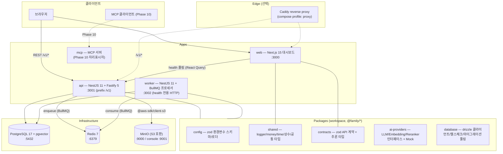

# 아키텍처 개요 — Family Memory AI

> 이 문서는 PRD §4 논리 아키텍처를 요약하고, **Phase 0에서 실제로 구현된 컴포넌트**를 표기한다.
> Phase 0의 단일 진실 소스는 [`docs/phase0-build-spec.md`](../phase0-build-spec.md)다.
>
> **상태 안내(2026-07-18):** 이 문서의 구현 상태 표는 Phase 0 기준의 역사적 개요다. 현재 저장소에는
> Phase 10까지의 Slack/RAG/장기 기억/Temporal Graph/MCP 경로가 구현되어 있다. 현행 AI 파이프라인 분석과
> 학습·평가 데이터 파이프라인 목표 설계와 P0~P3(격리 Training Runner·로컬 artifact 서빙 포함) 구현 상태는
> [AI 학습 데이터 파이프라인](./ai-learning-data-pipeline.md)을 기준으로 한다.

## 1. 설계 원칙

- **모듈러 모놀리스**: 배포 단위는 소수(api/worker/web)로 유지하되, 코드 경계는 workspace 패키지와 NestJS 모듈로 명확히 나눈다.
- **모델 비종속**: LLM/Embedding/Reranker는 인터페이스 뒤에 숨기고, Phase 0에서는 Mock만 배치한다(LLM 호출 없음).
- **로컬 완결 실행**: `docker compose up --build` 한 번으로 전체 스택이 기동한다.
- **데이터 원칙**: 금액은 KRW 정수, 기본 Timezone `Asia/Seoul`, 개인정보/Secret 로그 금지.

## 2. 논리 아키텍처 (PRD §4)

### 계층 설명

| 계층 | 역할 |
|---|---|
| **web** | Next.js(App Router) 대시보드. `NEXT_PUBLIC_API_URL`로 api의 `/v1/health/ready`를 폴링해 서비스 상태 배지를 표시. |
| **api** | HTTP API 진입점. 전역 prefix `v1`. Health/Dev 엔드포인트, DB/Queue/Storage/AI 경계 모듈 보유. |
| **worker** | BullMQ 큐 소비자. HTTP는 health 전용. api와 큐 이름 상수(`QUEUE_NAMES`)를 `@family/shared`로 공유. |
| **mcp** | 외부 AI 클라이언트용 도구 계층. **Phase 10 예정** — 현재 자리표시자만 존재. |
| **packages** | 앱 간 공유 코드. 계약(contracts)·설정(config)·공통 유틸(shared)·데이터(database)·AI 경계(ai-providers). |
| **infrastructure** | PostgreSQL(pgvector/pg_trgm/uuid-ossp 확장), Redis(BullMQ 백엔드), MinIO(S3 호환 스토리지), Caddy(선택 프록시). |

## 3. Phase 0 구현 상태

### 3.1 구현됨 (Phase 0)

| 컴포넌트 | 구현 내용 |
|---|---|
| `apps/web` | 대시보드(health 폴링 5s), `/api/health` (Docker healthcheck 전용) |
| `apps/api` | `GET /v1/health/live`·`/ready`, Dev 엔드포인트(echo/test-job/storage-test), Database/Storage/Queue/Ai 모듈 |
| `apps/worker` | `TestProcessor`(BullMQ `test` 큐), `GET /v1/health/live`·`/ready`(redis+db) |
| `packages/config` | `configSchema`/`validateEnv`/`loadConfig` (zod, coerce) |
| `packages/shared` | `createLogger`(민감 필드 redact), KRW 정수 헬퍼, Seoul 시간 헬퍼, `QUEUE_NAMES`, 공통 타입 |
| `packages/contracts` | health/test-job/storage-test 응답 zod 스키마 + 추론 타입 |
| `packages/ai-providers` | `LlmProvider`/`EmbeddingProvider`/`RerankerProvider` 인터페이스 + Mock 3종 + `createProviders` 팩토리 |
| `packages/database` | `createDbClient`/`checkConnection`/`checkPgVector`, drizzle-kit 툴링(마이그레이션 파일은 없음) |
| infrastructure | 공용 dev Dockerfile, postgres init SQL(확장 생성), MinIO 버킷 setup, Caddyfile(profile: proxy) |
| `docker-compose.yml` | postgres/redis/minio/minio-setup/api/worker/web/caddy(프로파일), healthcheck·의존 순서 정의 |

### 3.2 자리표시자 / 경계만 확보

| 컴포넌트 | 상태 |
|---|---|
| `apps/mcp` | README + noop package.json만. compose 미포함. **Phase 10 구현 예정** |
| AI Provider 실구현 | Mock만 존재. `AI_PROVIDER=mock` 고정 동작(openai/anthropic/google은 확장 지점) |
| DB 도메인 스키마 | `schema` 배럴 비어 있음. Phase 1에서 도메인 테이블 추가 예정 |

### 3.3 Phase 0에서 구현하지 않음 (스펙 §0)

가족 초대, 장치 HMAC, 카드 문자 Parser, Slack 연동, RAG, GraphRAG, MCP 서버 본체.
LLM 호출도 Phase 0에서는 수행하지 않는다(계산은 SQL/앱 로직).

## 4. 포트 맵

| 서비스 | 포트(컨테이너=호스트) | 헬스 |
|---|---|---|
| web (Next.js) | 3000 | `GET /api/health` |
| api (NestJS) | 3001 | `GET /v1/health/live` |
| worker (NestJS) | 3002 | `GET /v1/health/live` |
| postgres | 5432 | `pg_isready` |
| redis | 6379 | `redis-cli ping` |
| minio (S3 / console) | 9000 / 9001 | setup 컨테이너 완료로 대체 |
| caddy (profile: proxy) | 80/443 | — |

## 5. 관련 문서

- [ADR-0001 모듈러 모놀리스 채택](../adr/0001-use-modular-monolith.md)
- [ADR-0002 PostgreSQL + pgvector 채택](../adr/0002-use-postgresql-pgvector.md)
- [ADR-0003 pnpm + Turborepo 모노레포](../adr/0003-monorepo-pnpm-turborepo.md)
- [ADR-0004 모델 비종속 AI Provider](../adr/0004-model-agnostic-ai-providers.md)
- [ADR-0017 버전·계보 중심 AI 학습 데이터 파이프라인](../adr/0017-versioned-ai-learning-data-pipeline.md)
- [AI 학습 데이터 파이프라인 — 현행 분석과 목표 설계](./ai-learning-data-pipeline.md)
- [Health/Dev API 명세](../api/health.md)
- [Phase 0 빌드 스펙 (SSOT)](../phase0-build-spec.md)
